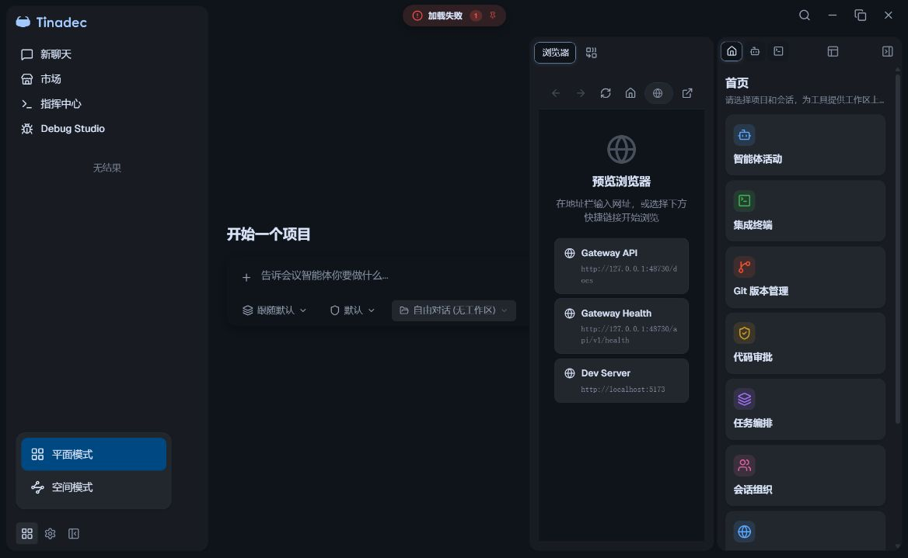
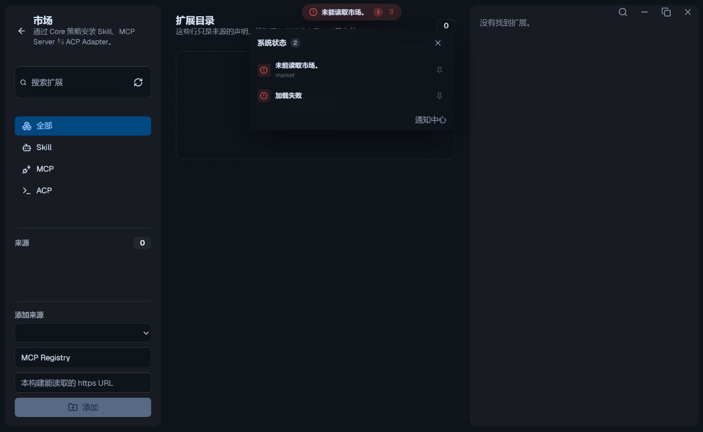
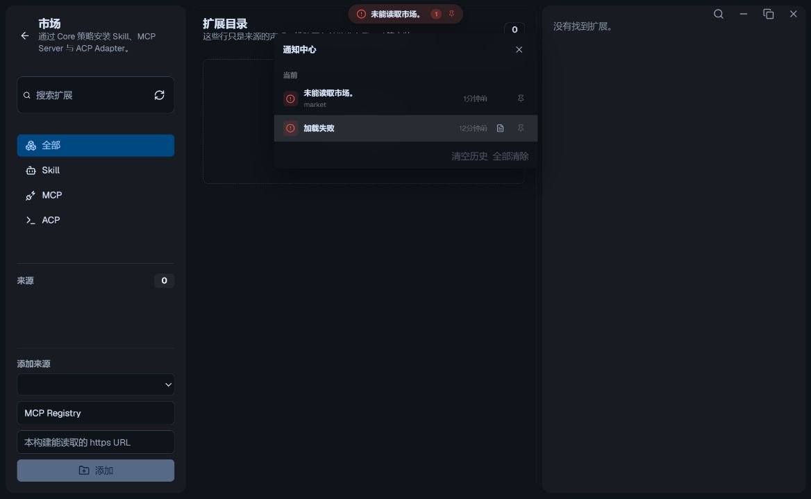
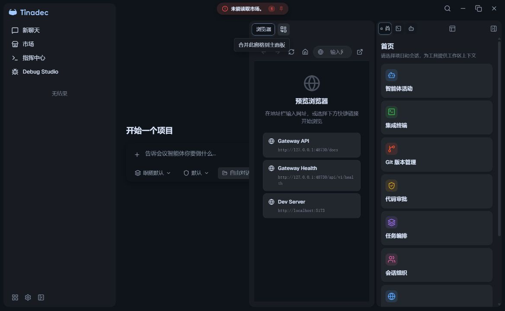

# 五条 UI 标注修复与实际页面验收

2026-10-09，Windows；基线 `d5e6c8d838f93f6bc26d4b7b77ecb0d9bdb9c2f3` + 当前工作树。主责任务：[APP-UIE-COMPONENTS-101](../../docs/development-program/02-modules/app/uie-components/TODO.md#app-uie-components-101)、[APP-RENDERER-105](../../docs/development-program/02-modules/app/shared-renderer/TODO.md#app-renderer-105)。保留此前 GraphSeedPack 修复；本轮处理用户五条浏览器标注。

## 每条问题对应的实现

| 标注 | 原问题与真实动作 | 修复 |
| --- | --- | --- |
| 1 | 浏览器分窗双箭头实际只执行 `mergeDockPane`，不是折叠 | `Combine` 图标，提示“合并此窗格到主面板” |
| 2 | 主面板双箭头执行 `mergeDockColumn`，与旁边 `collapseColumn` 混淆 | 合并全部用 `PanelsTopLeft`，收起用 `PanelRightClose`，提示“合并全部窗格”与“收起面板（保留窗格布局）” |
| 3 | 通知堆叠及通知中心标题前和行末重复 Pin | 删除两个列表的标题前 Pin 和孤立样式；保留右侧状态标记 |
| 4 | 快捷链接长 URL 在窄窗格中撑开水平 flex | 名称与完整 URL 上下排列，grid 文本列 `minmax(0, 1fr)`，地址 `overflow-wrap:anywhere`；原地址和导航行为不变 |
| 5 | 按钮实际打开显示模式菜单，原生 popover 无开合动画 | 实际菜单 160ms 淡入/位移/缩放；离散 display/overlay 过渡支持退出；减少动态效果禁用过渡；原生 invoker、aria-expanded、焦点恢复与即时选择 |

窗格三个动作使用原生按钮、28×28 点击区域及键盘焦点轮廓。Tooltip 按官方 shadcn-vue 组合使用 ReKa primitives、as-child 与 Portal，既有简易 tooltip 仅支持鼠标和局部绝对定位，不能满足这三个按钮的焦点/裁剪需求。`@tinadec/ui` 新增精确依赖 `reka-ui@2.11.0`，同步锁文件，未生成第二套布局或更改快照格式。

## 参考核查

官方 shadcn-vue Tooltip/Button/Popover 文档与本地官方源一并核对；CLI 与 HTTP 200 证据在 [pane-actions](../evidence/2026-10-09-ui-comments/pane-actions.md)。本次采用已有 UI 组合和语义 token。用户要求参考产品的范围按证据区分：

- shadcn-vue：固定提交 `b251d9fd92aa496495e127137a7734704fb34a29`，Tooltip 的键盘/鼠标提示、as-child、Portal 与状态驱动菜单动画。
- OpenCodeUI：`371cd9cf156280c325f3759972d096c29e6d71d4`，面板显隐与退出分窗有独立动作；其退出分窗仅保留 focused pane，不能复制到 Tinadec 的保留全部卡片契约。
- openchamber：`74b79d41eac44ff38790c66f238050936083e0bb`，Header 按钮的 Tooltip/type/aria，面板独立收起文案和 reduced-motion。
- DeepSeek Harness 的 DSH Claude Style：`bfc60ce7f3f3897a39252d43c0ce2be801a8d593`，读取 `src/shared/popover.css` 的 opacity/位移/缩放和文本收缩；这是主题插件，不能当作 Claude Desktop 自身源码。
- Codex Desktop 官方 app/features 页面和 Claude 官方下载页：HTTP 200，入口及标题留在 [页面来源](../evidence/2026-10-09-ui-comments/official-product-pages.json)。只作为公开产品背景，不声称读取其闭源桌面实现或实际运行两款产品。本地 `codex` HEAD `a06545b311fe01e51ce855c7aa5d8da21e9e7aaf` 为 CLI 仓库；`Codex-X` HEAD `8f018fddd3ee1a68464e4df8765eb370ede0c76f` 为第三方管理工具，两者不冒充 Codex Desktop UI 源码。

本地参考项目只读，没有安装、启动或修改它们。具体参考路径与取舍见 [窗格](../evidence/2026-10-09-ui-comments/pane-actions.md)、[通知](../evidence/2026-10-09-ui-comments/comment3-notification-pin.md)、[菜单](../evidence/2026-10-09-ui-comments/comment-5-view-menu.md)。

## 真实页面验收

使用 Computer Use 访问用户当前 `http://127.0.0.1:5173/#/`；视口保持原始 **1169×719**。通过实际按钮、键盘和鼠标拖拽验收，没有注入 DOM、伪造业务状态或改后端授权。

1. 实页三个按钮图标分别为 Combine、PanelsTopLeft、PanelRightClose，aria 名称与动作对应，测量均 28×28。
2. 键盘 Shift+Tab 聚焦“合并全部窗格”显示 Tooltip；Escape 后 tooltip 数量 0。实际重新悬停“合并此窗格到主面板”显示 Tooltip；`closest('.uie-stack')` 为 false，边界 x541–670、y88–119，提示通过 Portal 显示且不被 stack 裁剪。中文运行提示已验收；英文对应资源静态核对。
3. Enter 合并当前窗格，剩余 dock pane 数量 0，全部原标签仍存在。重新实际拖拽分窗，再 Enter 收起，轨道保留浏览器/终端/Agent；点击展开恢复两窗格。Space 合并全部后 dock pane 数量 0，首页/终端/Agent/浏览器四标签完整保留。
4. 宽卡片三链接 `clientWidth=scrollWidth=236`。分窗后窄卡片三链接均 `clientWidth=scrollWidth=225`；Gateway Health 地址高 29px、两行，卡片高约71.54px，另两地址一行14.5px，无水平溢出。最终与用户截图相近的更窄布局，三链接均 `clientWidth=scrollWidth=172`，Gateway API/Health 两行29px，Dev Server一行14.5px，已保存最终截图。
5. 通过市场只读页面的真实服务错误形成两条状态通知。堆叠与通知中心每条标题内 SVG/Pin 数量 0，右侧 Pin 数量 1；两个列表截图均核对。
6. 原生模式菜单打开时 aria-expanded=true，当前“平面模式”获焦点；Escape 后 false、焦点回到“切换显示模式”。关闭中间帧仍 display=block，opacity=0.914421，scale=0.998288、y=0.513477px，证明实际退出过渡。临时模拟 reduced-motion 后 transition=none，选择仍即时关闭并恢复焦点；模拟随后清除。

当前普通浏览器不具备 Electron trusted-host 身份，原有只读 API 返回授权错误。错误通知提供了本轮 UI 真实渲染样本；没有将这种浏览器边界改为允许匿名访问，也不将截图中的错误归因于本轮 UI 修改。重载一度超时/停留 splash；最终同一标签恢复正常并完成上述验收，无持续页面脚本异常。

## 活动验证与边界

| 检查 | 本轮结果 |
| --- | --- |
| BrowserTabBar 现有组件 | 3/3；初次缺 ReKa 依赖导致导入失败单独留档，安装后重跑通过 |
| UIE dock reducer + commandBus | 24/24 |
| 通知现有定向用例 | 46 passed / 14 既有 skipped；Island happy-dom/Vapor 跳过不冒充运行验收 |
| AppSidebar | 12/12；包括原生目标关联、即时事件/焦点和同一 Vue 应用多侧栏 ID |
| Desktop vue-tsc | 退出0 |
| Vite 生产构建 | 退出0，5m23s；保留 VueUse PURE 注释和 chunk-size 既有警告 |
| Native lock 检查 | Windows x64 declared/locked/installable |
| diff check、文档索引/链接校验 | 最终门禁结果追加于下方 |

实际 UI 验收使用当前开发页面；未运行完整安装器或 Linux/macOS GUI。生产构建使用独立输出目录，构建产物保留于忽略的 `.tinadec_dev/tmp/ui-comments-build-2026-10-09/`，未覆盖 Desktop 原 dist。没有删除用户存储、旧测试包、项目或配置；没有提交或推送。

最终文档索引门禁退出0：55模块、Core24工程/82职责节点完整覆盖、132功能/123任务、240 Markdown、2051链接/255唯一ID、errors=[]。仅为文档/源码门禁；产品活动测试与真实浏览器结果仍以上表为准。工作树diff check退出0。临时第二浏览器标签已关闭，用户原标签与浏览器分窗保留，模式菜单验收后收起；所有媒体模拟已清除。
