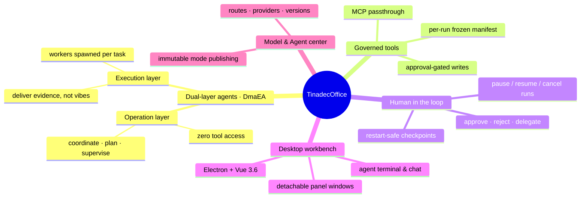
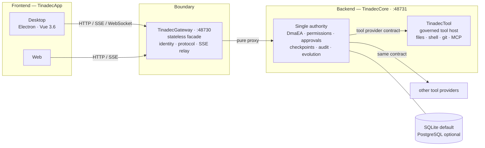
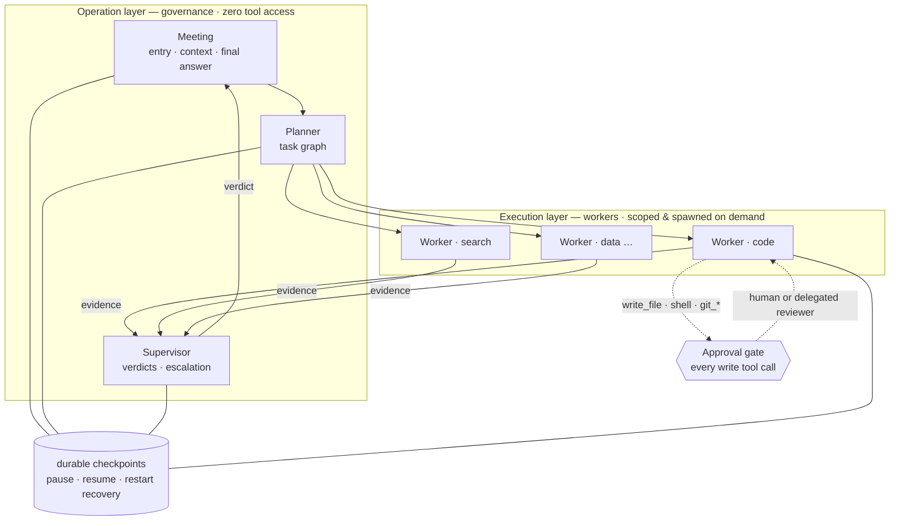
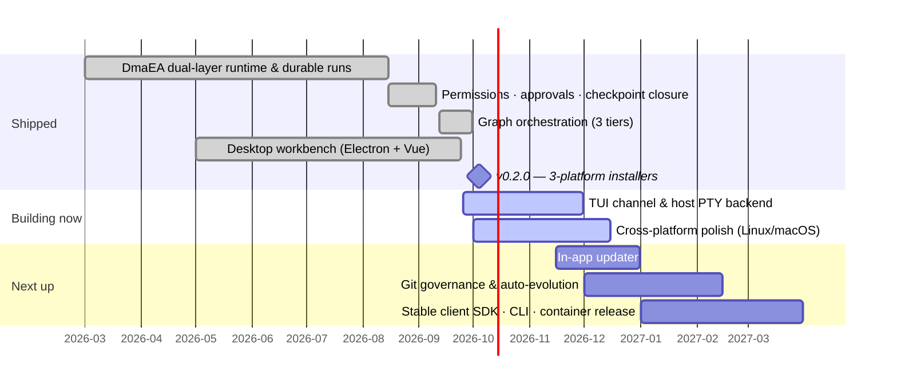

<!--
╔══════════════════════════════════════════════════════════════════╗
║                    BANNER SPACE RESERVED                         ║
║        Cover art / product screenshot — coming soon.             ║
╚══════════════════════════════════════════════════════════════════╝
-->

<p align="center">
  
</p>

<h1 align="center">TinadecOffice</h1>

<p align="center">
  <b>An AI-agent workbench built on a strict frontend/backend split and a dual-layer agent runtime.</b><br/>
  一款基于严格前后端分离与双层智能体运行时（DmaEA）的 AI 智能体工作台。
</p>

<p align="center">
  <a href="README.md"></a>
  <a href="README.zh-CN.md"></a>
</p>

<p align="center">
  <a href="https://github.com/Tinadec/TinadecOffice/releases"></a>
  <a href="#license"></a>
  
  
  
  
</p>

<p align="center">
  <a href="https://github.com/Tinadec/TinadecOffice/commits"></a>
  <a href="https://github.com/Tinadec/TinadecOffice/commits"></a>
  <a href="https://github.com/Tinadec/TinadecOffice/graphs/contributors"></a>
</p>

<p align="center">
  <a href="https://discord.gg/EcKYQfbG72"></a>
  <a href="#community"></a>
  <a href="https://applink.feishu.cn/client/chat/chatter/add_by_link?link_token=7a3k9813-07f8-4e13-b00c-d9d1c07d539b"></a>
</p>

---

## What is TinadecOffice?

TinadecOffice is a **product family for multi-agent collaboration**: every piece — the desktop app, the stateless gateway, the governance runtime, and the governed tool host — ships and can be replaced **independently**. The frontend never holds business state; the backend never knows about pixels. All authority over permissions, approvals, checkpoints, and tool side effects lives in exactly one place: **TinadecCore**.

**v0.2.0 is live** — signed installers for Windows, Linux and macOS. All public HTTP / OpenAPI / SSE / WebSocket contracts are permanently fixed at `/api/v1`: no v2, no legacy aliases, ever.



## Architecture

### The boundary that never moves

The desktop app **never** talks to Core directly. The gateway is a **permanent, stateless facade** — identity, protocol adaptation, and stream forwarding only. No second copy of business state exists anywhere but Core.



### One runtime, two layers of agents

DmaEA (Dual-layer Modular Agent Architecture) separates **the agents that govern** from **the agents that do**:



- The operation layer **cannot invoke any tool** — enforced as permission data, not as a convention.
- Every worker's tool surface = its instance grant ∩ the **run-frozen tool manifest** (hash-pinned, immutable).
- Tool calls that mutate anything wait at an **approval gate**: a human click, a delegated reviewer gate, or a pre-authorized lease — always auditable.

## Where we are



## Quick start

```powershell
npm install
npm run restore:dotnet
npm run dev
```

| Service | Address |
|---------|---------|
| Desktop (Vite) | http://127.0.0.1:5173 |
| Gateway API / Docs | http://127.0.0.1:48730/docs |
| Core | http://127.0.0.1:48731 |

For startup details and troubleshooting see [docs/startup.md](docs/startup.md).

<details>
<summary><b>Development commands</b></summary>

```bash
npm run dev              # Core + Gateway + Desktop together
npm run dev:core         # Core only (48731)
npm run dev:gateway      # Gateway only (48730)
npm run dev:desktop      # Desktop only (5173)
npm run build            # workspaces + .NET solution
npm test                 # tests
```

Core-only build:

```powershell
Remove-Item Env:Version -ErrorAction SilentlyContinue
dotnet restore TinadecCore/TinadecCore.slnx
dotnet build TinadecCore/TinadecCore.slnx --no-restore
dotnet test TinadecCore/TinadecCore.slnx --no-build
```

</details>

## Repository layout

```
TinadecOffice/
├── TinadecCore/              # MAF + DmaEA agent-governance runtime (.NET 10)
├── TinadecGateway/           # optional Elysia API facade / protocol adapter
├── apps/                     # TinadecApp clients (desktop / web / TinadecUI)
├── TinadecTools/             # TinadecTool: governed file / shell / git / MCP tools
├── TinadecTools.Generators/  # [ToolFunction] static-registry source generator
├── tests/                    # tools tests + legacy Core / contract evidence tests
├── docs/                     # product model, architecture, security, startup guides
└── TinadecOffice.slnx        # root solution
```

## Documentation

| Document | Purpose |
|----------|---------|
| [Core product definition & DmaEA baseline](docs/tinadec-core-product-definition.zh-CN.md) | Authoritative: positioning, DmaEA, permissions, evolution, roadmap |
| [Core reference decisions](docs/tinadec-core-reference-decisions.zh-CN.md) | MAF + nine reference projects: evidence, adoptions, rejections |
| [Harness integration model](docs/agent-harness-product-model.zh-CN.md) | Integration/deployment responsibilities ([English](docs/agent-harness-product-model.en.md)) |
| [Architecture](docs/architecture.md) | Technical architecture, ports, event shapes |
| [Startup guide](docs/startup.md) | Local startup & troubleshooting |
| [Security](docs/security.md) | Security boundaries and constraints |
| [Core packaging & standalone deployment](docs/tinadec-core-packaging.zh-CN.md) | NuGet packages, API publish directory, delivery boundary |

## Community

- **Discord** — [discord.gg/EcKYQfbG72](https://discord.gg/EcKYQfbG72)
- **QQ Group** — `370780878`
- **Feishu Group** — [join via link](https://applink.feishu.cn/client/chat/chatter/add_by_link?link_token=7a3k9813-07f8-4e13-b00c-d9d1c07d539b)

## Contributors

<a href="https://github.com/Tinadec/TinadecOffice/graphs/contributors">
  
</a>

## Star history

<a href="https://star-history.com/#Tinadec/TinadecOffice&Date">
  
</a>

## License

Copyright (c) 2026 Lincube

| Scope | License | Location |
|-------|---------|----------|
| TinadecOffice overall (incl. `apps/desktop`, `apps/web`, `apps/TinadecUI`, `docs`, `scripts`) | `GPL-3.0-or-later` | [`LICENSE`](LICENSE) |
| `TinadecCore` (all modules under `TinadecCore/` + NuGet packages `TinadecCore.Contracts`/`Abstractions`/`Runtime`) | `MIT` | [`TinadecCore/LICENSE`](TinadecCore/LICENSE) |
| `TinadecGateway` | `AGPL-3.0-or-later` | [`TinadecGateway/LICENSE`](TinadecGateway/LICENSE) |
| `TinadecTools` (incl. `TinadecTools.Generators`) | `AGPL-3.0-or-later` | [`TinadecTools/LICENSE`](TinadecTools/LICENSE) |

Third-party attributions live in [`NOTICE`](NOTICE). Combined distribution must satisfy the strictest component's obligations (AGPL-3.0 §13 network-service clause for Gateway/Tools).
