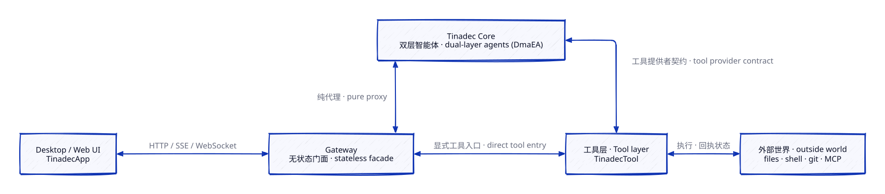
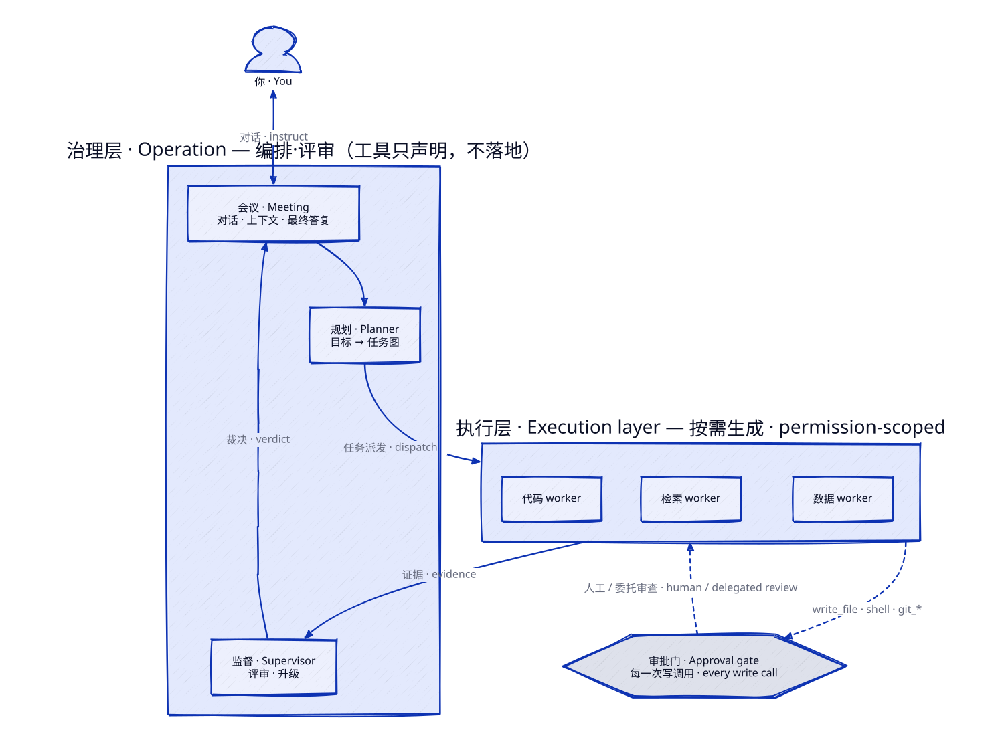
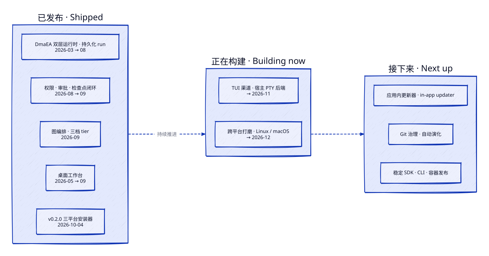

<p align="center">
  
</p>

<h1 align="center">TinadecOffice</h1>

<p align="center">
  <b>一款基于严格前后端分离与双层智能体运行时（DmaEA）的 AI 智能体工作台。</b><br/>
  An AI-agent workbench built on a strict frontend/backend split and a dual-layer agent runtime.
</p>

<p align="center">
  <a href="README.md"></a>
  <a href="README.zh-CN.md"></a>
</p>

<p align="center">
  <a href="https://github.com/Tinadec/TinadecOffice/releases"></a>
  <a href="#许可证"></a>
  
  
  
  
</p>

<p align="center">
  <a href="https://github.com/Tinadec/TinadecOffice/commits"></a>
  <a href="https://github.com/Tinadec/TinadecOffice/commits"></a>
  <a href="https://github.com/Tinadec/TinadecOffice/graphs/contributors"></a>
</p>

<p align="center">
  <a href="https://discord.gg/EcKYQfbG72"></a>
  <a href="#社区"></a>
  <a href="https://applink.feishu.cn/client/chat/chatter/add_by_link?link_token=7a3k9813-07f8-4e13-b00c-d9d1c07d539b"></a>
  <a href="https://x.com/tinadecoffice"></a>
</p>

---

## TinadecOffice 是什么？

TinadecOffice 是面向**多智能体协作**的产品族：桌面客户端、无状态网关、治理运行时、受治理的工具宿主——每一个都**独立部署、独立替换**。前端永不保存业务状态，后端永不感知界面。权限、审批、检查点、工具副作用的全部权威状态只存在于一个地方：**TinadecCore**。

**v0.2.0 已发布** —— Windows / Linux / macOS 三平台安装器。所有 HTTP / OpenAPI / SSE / WebSocket 公共契约**永久固定**在 `/api/v1`：没有 v2，没有 legacy 别名，永远不会有。

**它能做什么**

- **编排一支智能体团队，而不是一个聊天机器人**——治理层负责规划、派发、评审；执行层的 worker 按需生成、权限收窄，交付证据。你随时可以批准、拒绝、委托、暂停、恢复、取消。
- **每一次写操作都关在门后**——文件、shell、git 的写入都要过审批门；每个 run 的工具清单与配置在启动时哈希冻结、不可变。
- **接入工具与外部世界**——受治理的文件 / shell / git 工具，外加 MCP 透传，全部走同一条工具提供者契约。
- **按你的方式调度模型**——模型与智能体中心：路由、provider、逐智能体策略、不可变的版本发布。
- **在一个真正的工作台里干活**——可分离面板窗口、智能体终端、run 时间线，以及智能体之间的交流频道。

## 架构

### 前后端，严格分离

UI 只看得到 Gateway。业务状态只活在 Core 里。工具层是唯一触碰外界的东西——而且它会沿同一条线路把外界状态报回来。

<p align="center">
  
</p>

### 一个运行时，两层智能体

DmaEA（双层模块化智能体架构）把**治理团队的智能体**和**干活的智能体**分开——团队编排能力就来自这个分层：

<p align="center">
  
</p>

- 治理层**只编排、不落地**——它规划、派发、评审。它可以*声明*工具，但调用一律经由 Core 的派发器执行，可调用实现绝不会握在治理智能体自己手里。
- 工具权限从不隐式授予：来自包的显式 `tool_scope` 和 envelope 的显式写授权，每一次写操作仍要过**审批门**——人工或委托审查。
- 每个 worker 的工具面 = 实例授权 ∩ **run 冻结工具清单**（哈希钉死、不可变）。
- run 是持久化的：可暂停、可恢复、可取消，重启后仍能接着跑。

## 我们进行到哪一步

<p align="center">
  
</p>

## 快速开始

```powershell
npm install
npm run restore:dotnet
npm run dev
```

| 服务 | 地址 |
|------|------|
| Desktop (Vite) | http://127.0.0.1:5173 |
| Gateway API / Docs | http://127.0.0.1:48730/docs |
| Core | http://127.0.0.1:48731 |

更细的启动与排障见 [docs/startup.md](docs/startup.md)。

<details>
<summary><b>常用开发命令</b></summary>

```bash
npm run dev              # 同时启动 Core + Gateway + Desktop
npm run dev:core         # 仅 Core（48731）
npm run dev:gateway      # 仅 Gateway（48730）
npm run dev:desktop      # 仅 Desktop（5173）
npm run build            # 构建工作区与 .NET 解决方案
npm test                 # 运行测试
```

仅构建 Core：

```powershell
Remove-Item Env:Version -ErrorAction SilentlyContinue
dotnet restore TinadecCore/TinadecCore.slnx
dotnet build TinadecCore/TinadecCore.slnx --no-restore
dotnet test TinadecCore/TinadecCore.slnx --no-build
```

</details>

## 项目结构

```
TinadecOffice/
├── TinadecCore/              # MAF + DmaEA 智能体治理运行时（.NET 10）
├── TinadecGateway/           # 可选 Elysia API 门面 / 协议适配
├── apps/                     # TinadecApp 客户端（desktop / web / TinadecUI）
├── TinadecTools/             # TinadecTool：受治理的文件 / shell / git / MCP 工具
├── TinadecTools.Generators/  # [ToolFunction] 静态注册表源生成器
├── tests/                    # 工具测试 + 遗留 Core / 契约证据测试
├── docs/                     # 产品模型、架构、安全、启动手册
└── TinadecOffice.slnx        # 根解决方案
```

## 文档

| 文档 | 用途 |
|------|------|
| [TinadecCore 产品定义与 DmaEA 架构基线](docs/tinadec-core-product-definition.zh-CN.md) | Core 定位、DmaEA、权限、配置、演化与路线图（权威基线） |
| [TinadecCore 参考决策](docs/tinadec-core-reference-decisions.zh-CN.md) | MAF 与九个参考项目的源码证据、采用项和拒绝项 |
| [Harness 集成模型](docs/agent-harness-product-model.zh-CN.md) | 当前集成部署职责（[English](docs/agent-harness-product-model.en.md)） |
| [架构](docs/architecture.md) | 技术架构、端口、事件形态 |
| [启动手册](docs/startup.md) | 本地启动与故障排查 |
| [安全](docs/security.md) | 安全边界与约束 |
| [TinadecCore 打包与独立部署](docs/tinadec-core-packaging.zh-CN.md) | NuGet 包、API 发布目录与独立交付边界 |

## 社区

- **QQ 群** —— `370780878`
- **飞书群** —— [点击加入](https://applink.feishu.cn/client/chat/chatter/add_by_link?link_token=7a3k9813-07f8-4e13-b00c-d9d1c07d539b)
- **Discord** —— [discord.gg/EcKYQfbG72](https://discord.gg/EcKYQfbG72)
- **X (Twitter)** —— [@tinadecoffice](https://x.com/tinadecoffice)

## 贡献者

<a href="https://github.com/Tinadec/TinadecOffice/graphs/contributors">
  
</a>

## Star 历史

<a href="https://star-history.com/#Tinadec/TinadecOffice&Date">
  
</a>

## 许可证

Copyright (c) 2026 Lincube

| 范围 | 许可证 | 位置 |
|------|--------|------|
| TinadecOffice 整体（含 `apps/desktop`、`apps/web`、`apps/TinadecUI`、`docs`、`scripts`） | `GPL-3.0-or-later` | [`LICENSE`](LICENSE) |
| `TinadecCore`（`TinadecCore/` 下全部模块与 NuGet 包 `TinadecCore.Contracts`/`Abstractions`/`Runtime`） | `MIT` | [`TinadecCore/LICENSE`](TinadecCore/LICENSE) |
| `TinadecGateway`（`TinadecGateway/`） | `AGPL-3.0-or-later` | [`TinadecGateway/LICENSE`](TinadecGateway/LICENSE) |
| `TinadecTools`（`TinadecTools/` 与 `TinadecTools.Generators/`） | `AGPL-3.0-or-later` | [`TinadecTools/LICENSE`](TinadecTools/LICENSE) |

第三方归属见 [`NOTICE`](NOTICE)。`TinadecTools.Generators` 继承 `TinadecTools/LICENSE`，不单独提供 LICENSE 文件。组合分发需满足最严格组件的义务（Gateway/Tools 的 AGPL-3.0 第13条网络服务条款）。
