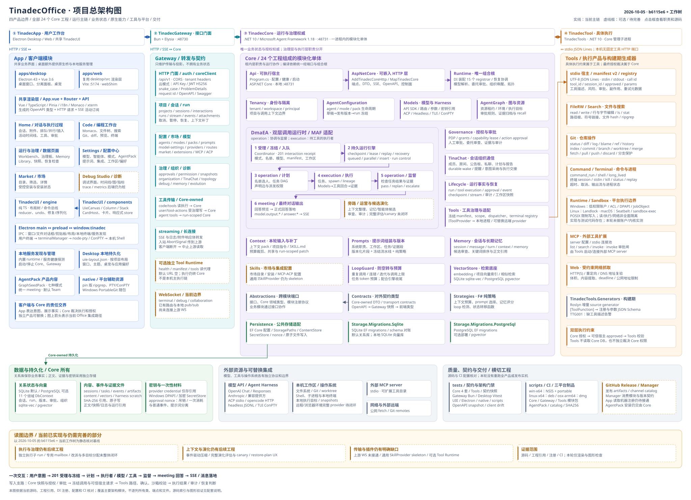

# TinadecOffice 项目总架构图

基线：2026-10-05，`b6115e6` + 当前工作树。依据实际工程引用、源码、DI 注册、配置和 CI 静态核对。覆盖四个产品、Core 全部 **24 个产品工程（23 C# + 1 F#）**，以及客户端、Gateway、Tools、数据、原生资源与发布体系；不逐列每个类和 HTTP 端点。

- [交互版：缩放、拖动、搜索、点击模块查看职责和源码](tinadecoffice-overview.html)
- [SVG 矢量总图](tinadecoffice-overview.svg)
- [4240 × 3070 PNG 总图](tinadecoffice-overview.png)
- [可维护的结构化模块模型](architecture-model.json) · [生成源码](generate.mjs)



## 从四个产品理解项目

**App 是用户工作台，Gateway 是接口门面，Core 是运行与治理权威，Tools 是具体执行产品。** 当前 Office 把四者集成为本地工作台：桌面/Web 渲染层通过 HTTP 和 SSE 使用 Gateway，Gateway 代理 Core，Core 通过标准输入输出管理 TinadecTools 子进程。四者分别版本化，这条集成主链不是所有部署都必须采用的永久依赖链。

图中紫色 Core 框是一个 .NET 进程内的模块化单体。内部模块通过 `Abstractions` 的端口协作，`Runtime` 负责装配；运行调用关系不等于各模块互相引用具体实现，也不代表每个框是独立微服务。

### 左侧 App：表达意图和展示结果

`apps/desktop` 是 Electron 桌面壳与 Vue 渲染层。Home 负责项目、会话、附件、消息投递与运行活动；Code 提供 Monaco 编辑、文件树、Git、diff、搜索、预览和终端；Workbench、治理板、Memory、Library、Snapshots、RecoveryCheck 展示运行和数据。Settings 管理模型、智能体、模式、提示词、AgentPack 与集成。Market 展示市场并提交受控安装提案。Debug Studio 界面存在，但 trace/metrics 等部分后端仍是桩。

`apps/web` 复用 `desktop/src` 的业务界面，通过 `webShim` 适配浏览器。当前 Web 没有本地 PTY、桌宠、分离窗口、原生目录选择或 Electron 磁盘布局 adapter。

`apps/TinadecUI` 提供唯一工作台布局系统 UIE。**Engine** 是纯 TS 的布局树、命令总线、reducer、撤销/重做、修复和持久化协议；**Components** 是 Canvas、Column、Stack、Dock、CardHost、卡片与响应式 store，单向依赖 Engine。当前注册 15 种 Home/Market 卡片。桌面布局按项目/页面保存在 `uie-layout.json`。

Electron 原生桥用于窗口、对话框、剪贴板、偏好、布局、宠物与用户本地终端。业务文件和 Git 经 Gateway → Core → Tools，不能把 Electron 画成另一套文件/Git 执行后端。

### 第二列 Gateway：传输、认证与契约

Gateway 使用 Bun + Elysia，当前本地端口 `48730`。云模式提供 API Key、JWT HS256 与租户头处理；本地模式跳过认证。`coreClient.ts` 代理 JSON/raw/SSE，`streaming.ts` 处理附件、日志与取消信号，TinaChat/organization 路由按 Core 契约生成投影。它不裁决工具权限、不计算审批策略，也不持有第二份会话和运行状态。

配置 `TINADEC_TOOL_RUNTIME_URL` 后，独立 Tool Runtime 只承接 health/manifest/tools **读查询**；执行接口仍转 Core。默认 URL 为空，没有默认 `48732` 工具 HTTP 服务。Gateway 的三个 WS 路由目前只做本地 pub/sub，未连接上游。

### 中间 Core：组织工作、裁决权限、保存事实

Core 的入口是 `Api → AspNetCore → Runtime`：可执行宿主启动 HTTP 挂载层，挂载层使用组合根装配全部业务模块。

| 工程 | 职责与源码入口 |
| --- | --- |
| Api | [可执行宿主、启动与配置](../../../TinadecCore/Api/Program.cs) |
| AspNetCore | [可嵌入 HTTP、端点、SSE、OpenAPI](../../../TinadecCore/AspNetCore/TinadecCoreEndpointRouteBuilderExtensions.cs) |
| Runtime | [DI 装配和跨模块适配](../../../TinadecCore/Runtime/TinadecCoreServiceCollectionExtensions.cs#L32) |
| DmaEA | [双层计划、执行、监督、回答与持久引擎](../../../TinadecCore/DmaEA/FullDuplexRunEngine.cs#L664) |
| AgentConfiguration | [agent/mode/pack 草稿、发布和安装生命周期](../../../TinadecCore/AgentConfiguration/AgentConfigurationModuleRegistrar.cs) |
| AgentGraph | [资源租约、环境/执行目标、审批规则与证据检索](../../../TinadecCore/AgentGraph/AgentGraphModuleRegistrar.cs) |
| Governance | [PDP、能力 grant、permission、lease、审批](../../../TinadecCore/Governance/GovernanceModuleRegistrar.cs) |
| TinaChat | [会话组织、成员、房间、消息、报告、持久唤醒](../../../TinadecCore/TinaChat/TinaChatModuleRegistrar.cs) |
| Models | [模型路由/参数与 API、ACP、headless、TUI 适配](../../../TinadecCore/Models/Harness/AgentChatClientFactory.cs#L18) |
| Context | [本轮 ContextPack、工作区指令、SKILL.md、补丁与预算](../../../TinadecCore/Context/ContextModuleRegistrar.cs) |
| Prompts | [版本化片段与冻结流水线的确定性组装](../../../TinadecCore/Prompts/PromptsModuleRegistrar.cs) |
| Memory | [会话、消息、turn、长期记忆候选与关键词检索](../../../TinadecCore/Memory/MemoryModuleRegistrar.cs#L43) |
| Skills | [市场目录/安装及集成配置；通用 SkillProvider 仍为空实现](../../../TinadecCore/Skills/SkillsModuleRegistrar.cs#L43) |
| Tools | [Core 内工具目录、scope、dispatcher、子进程与终端桥](../../../TinadecCore/Tools/ToolsModuleRegistrar.cs#L19) |
| Lifecycle | [运行/工具/审批/事件、checkpoint、快照与恢复基础](../../../TinadecCore/Lifecycle/LifecycleModuleRegistrar.cs) |
| LoopGuard | [任务循环、重复指纹、连续错误和预算策略](../../../TinadecCore/LoopGuard/LoopGuardModuleRegistrar.cs) |
| Tenancy | [tenant/workspace/principal 与身份范围](../../../TinadecCore/Tenancy/TenancyModuleRegistrar.cs) |
| VectorStore | [项目向量索引与检索，已用于证据档案](../../../TinadecCore/VectorStore/VectorStoreModuleRegistrar.cs) |
| Persistence | [EF Core、ContentStore、SecretStore、nonce、路径](../../../TinadecCore/Persistence/ServiceCollectionExtensions.cs) |
| Storage.Migrations.Sqlite | [SQLite 迁移](../../../TinadecCore/Storage.Migrations.Sqlite/TinadecCore.Storage.Migrations.Sqlite.csproj) |
| Storage.Migrations.PostgreSql | [PostgreSQL 迁移](../../../TinadecCore/Storage.Migrations.PostgreSql/TinadecCore.Storage.Migrations.PostgreSql.csproj) |
| Strategies | [F# 纯策略：预算、选择、评分、循环检测与状态函数](../../../TinadecCore/Strategies/TinadecCore.Strategies.fsproj) |
| Abstractions | [跨模块端口、领域类型与模块注册契约](../../../TinadecCore/Abstractions/TinadecCore.Abstractions.csproj) |
| Contracts | [Core-owned 对外 DTO 与传输类型](../../../TinadecCore/Contracts/TinadecCore.Contracts.csproj) |

**DmaEA 的双层分工**：`operation` 组织、规划、监督与用户对话；`execution` 执行任务、调用模型/工具并产生证据。工具面由冻结配置和授权约束，当前代码允许 operation 身份按模式配置拥有自己的工具，不能把“治理层永久零工具”当成引擎规则。

**Context / Prompts / Memory** 的区别：Memory 保存历史事实与已审查的长期记忆，Context 选择本轮需要的事实并控制输入预算，Prompts 把这些输入与冻结职责/提示词片段组装成模型调用。Memory 当前使用关键词评分；AgentGraph 的证据档案已接向量与关键词混合检索。

**Governance / AgentGraph / TinaChat** 的区别：Governance 决定谁被允许做什么；AgentGraph 管理任务图协作中的资源、执行目标与证据；TinaChat 提供成员之间的组织通信、报告与持久唤醒。全局聊天室页面已删除，会话组织机制及 Core 观察接口仍保留。

### 右侧 Tools：把调用变成真实操作

Core 的 `Tools` 模块负责权限、范围、审批、冻结目录和派发；外部 `TinadecTools` 实现文件、搜索、Git、命令/终端、MCP 和 Web 抓取。两者之间是 UTF-8 JSON Lines stdio，先查询 manifest v2 并冻结 hash，后续调用按 call id 关联结果。

工具进程接收可信宿主提供的 `approved`，再检查路径根、确认字段、保护分支和平台沙箱；它不读 Core DB，也不独立裁决 Core 权限。`TinadecTools.Generators` 是构建期 Roslyn 增量生成器，生成工具注册和参数 schema，缺描述发 TTG001，不是运行服务。

一次性和长驻 shell 已接平台沙箱入口。Windows 使用低权限账户、ACL、DPAPI 与 JobObject；Linux 使用 Landlock，macOS 使用 Seatbelt/sandbox-exec。POSIX 主要限制写入，读/执行/网络没有全面隔离。MCP 当前是 stdio client；工具产品没有自带浏览器自动化或 A2A 运行适配器。

## 一条用户消息怎样走完整架构

1. App 提交 interaction；Core 检查身份、会话 revision 与幂等性，冻结模式、名册、模型、工作区与工具 manifest，返回 **201 JSON receipt**。
2. 客户端另外订阅 run SSE。持久引擎推进计划，按职责/派发关系构造任务图。
3. 执行者通过 Models 调模型；Context、Prompts 和 Memory 参与本轮输入。工具任务经过资源范围、持久执行记录、快照和授权/审批检查。
4. Core dispatcher 将允许执行的调用发到 TinadecTools；工具返回结构化结果、终端事件与证据。工具需等待审批时运行可以驻留，裁决后恢复。
5. 监督检查任务事实，选择通过、重规划或升级给用户。meeting 对话身份形成最终回答；公开预览通过 SSE 提前展示，正式回答在裁决后落地。
6. Lifecycle/Memory 保存运行与会话事实，证据存入内容/档案。运行生命周期还能触发上下文整理、能力顾问及候选策展等旁路。

用户直接写文件或 Git 的路径是 `user/tool-actions`：Core 创建 durable action，完成快照、授权/审批、执行和审计。用户动作不需要伪造 agent run。

**终端有两条路径**：用户终端是 xterm → Electron IPC → node-pty → OS Shell；智能体终端由 Core → Tools 管理，输出通过 journal/SSE，stdin/kill 经 HTTP。两者都不依赖当前未接通上游的 Gateway WS。

## 底部：状态、资源与交付

默认关系库为 SQLite，也支持 PostgreSQL。**11 个领域 DbContext** 分别拥有自己的数据分区，不代表 11 个独立数据库。Core-owned 文件根包含 sessions/tasks/events/artifacts/content/vectors/harness-workspaces；正文通过 SHA-256 引用和原子写与关系状态关联。密钥单独保存在 SecretStore：Windows 默认 DPAPI，POSIX 默认 AES-GCM 加密文件。

活动测试与契约体系覆盖 Core 四套、Tools、Gateway、Desktop、UIE、Electron/native/scripts 和 OpenAPI 快照/客户端漂移；旧 `tests/Tinadec.Contracts.Tests` 不在活动解决方案且不可构建，只作为遗留需求证据。Core OpenAPI → Gateway 契约投影与外部快照 → 前端生成类型构成契约维护链。

发布 CI 已有 win-x64、linux-x64、osx-arm64 三平台：NSIS/portable、deb、dmg；同时生成 Core/Gateway/Tools 模块包与 AgentPack、catalog 和 SHA256。Manager 是仓库外的模块消费者。**当前 App 只读取内置 runtime，规范中的 Manager 机器注册交接尚未接通**。

## 图上虚线框的含义

虚线框标记可选集成、骨架或未整体闭环能力：上游 WebSocket、通用 SkillProvider、部分 Debug Studio 后端、Manager 注册交接，以及完整执行子 run/mailbox/改派与多目标分配、事件驱动压缩、完整演化评估/canary、restore-plan UX。已经落地的并发、唤醒、资源、候选和控制切片仍在实线模块内展示。

这些状态由本轮源码核对得出，不能把历史 AGENTS 记录中的“未做”直接当作现状，也不能把一个已存在的接口当作完整能力验收。

## 本轮验证与维护

生成器枚举当前 Core 的 `.csproj/.fsproj` 并与图中工程标签严格匹配，覆盖 **24/24**。82 个模块与职责框的相关模块引用均解析成功；源码位置均检查文件存在。实际用 Edge 渲染 SVG/HTML，检查所有节点文字边界、浏览器异常、缩放、搜索、详情、相关模块高亮、重置和窄窗口适配；结果见 [render-checks.json](render-checks.json)。

本轮未改业务代码，也未重跑业务测试、真实模型、安装器或账户/内核沙箱。图形验证不能替代产品端到端验收。

在仓库根目录执行下面的命令可重新生成离线 HTML、SVG 与结构化模型；PNG 需要浏览器渲染导出。

```powershell
node docs/architecture-views/overview-2026-10-05/generate.mjs
```
