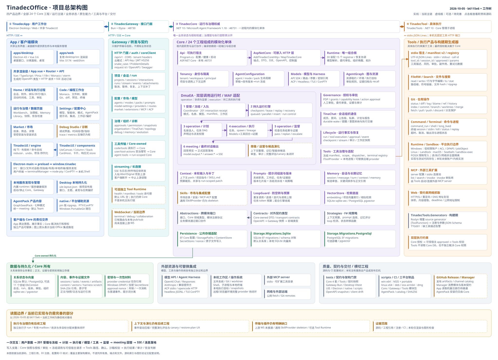

# 总架构图与当前边界

基线：2026-10-05，b6115e6 + 当前工作树。本目录归档已有总架构图，作为整个开发工程的导航入口；原日期目录保留历史链接。

- [可缩放、可搜索、可点击的离线总图](tinadecoffice-overview.html)
- [高清 PNG](tinadecoffice-overview.png) · [SVG 矢量图](tinadecoffice-overview.svg)
- [完整架构讲解](ARCHITECTURE-GUIDE.md) · [结构化总图模型](architecture-model.json)
- [模块目录与完成情况索引](../MODULE-INDEX.md) · [总 TODO](../01-program/MASTER-TODO.md)

总图展开82个职责框；模块档案按实际职责合并为55个目录，其中Core24个工程逐一独立。DmaEA的阶段框属于同一工程；产品边界和全局缺口摘要属于总览，不重复建立伪模块。

## 图与档案如何同步

1. 修改总图的生成源码/结构化模型，核对真实源码边界，再重新生成本目录HTML、SVG和模型；PNG需浏览器重新导出。
2. 模块职责/依赖变化时同时更新对应模块ARCHITECTURE/README/STATUS；模块SVG和Mermaid应与正文一致。
3. 修改任务与功能状态后，从仓库根执行 `node docs/development-program/scripts/reindex.mjs` 更新汇总。
4. 历史总图目录保留为快照，不当作本工程持续开发的最新入口。

图中文字的“源码存在”不等于已验收；各功能完成情况由模块STATUS和证据记录负责。
