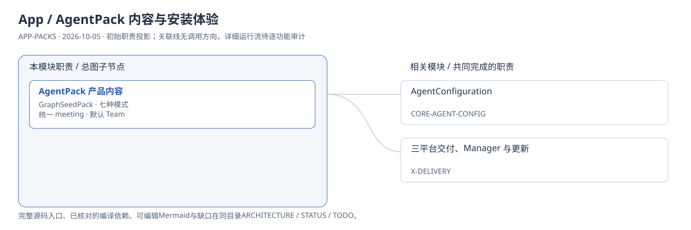
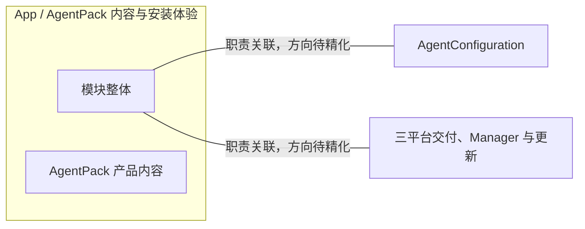
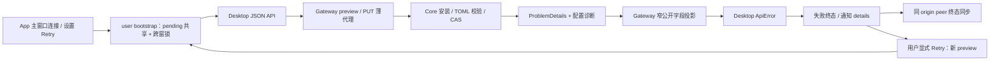

# App / AgentPack 内容与安装体验：模块架构

模块ID：`APP-PACKS` · 基线：2026-10-05，b6115e6 + 当前工作树。

这是总图的**模块职责投影**：实线无箭头表示相关职责，不表示调用先后。逐模块审计任务将补充成功/失败、控制流、数据流和恢复关系；仅ProjectReference箭头表示已从工程文件读出的编译依赖。

## 可编辑架构图

## 模块边界与输入/输出

| 职责 | 当前边界 | 来源 |
| --- | --- | --- |
| AgentPack 产品内容 | App 携带包制品，Core 负责 preview/install、归属、启禁与不可变发布版本。Solo/Plan/Team/Review/Spec/Graph/Workflow 是包定义。 | [apps/desktop/src/agentPacks/GraphSeedPack/manifest.json](../../../../../apps/desktop/src/agentPacks/GraphSeedPack/manifest.json) |

## 继续精化时必须补齐

### 已核对的安装与错误路径（2026-10-09）

入口来源 `App.vue`、`AgentPacksPanel.vue`；请求和状态来源 `graphSeedPackBootstrap.ts`、`api.ts`、`lib/apiError.ts`；薄代理与公开投影来源 `TinadecGateway/src/index.ts`、`mappers/errorMapper.ts`。400 配置校验失败终止当前尝试；409/412 才检查是否已有并发安装成功。普通重连与队列窗口检查失败终态，不把 error 覆盖为 deferred。实际安装事实仍从 Core preview 获得；单个窗口重载后的纯内存状态不能代替持久安装回执。

该有向图仅覆盖 APP-PACKS-102 的已核对路径，下列模块整体审计要求仍有效。

- 实际入口、调用方向与状态所有者；每个有向关系有源码依据。
- 成功与错误/取消路径、身份/权限边界、异步与恢复时序。
- 哪些是Core内部端口、哪些跨进程/HTTP/stdio，哪些仅是UI职责关联。
- 已确认缺口使用不同标记；目标图与当前图分别说明，避免合并成假现状。

任务入口：[APP-PACKS-001](TODO.md#app-packs-001)。
