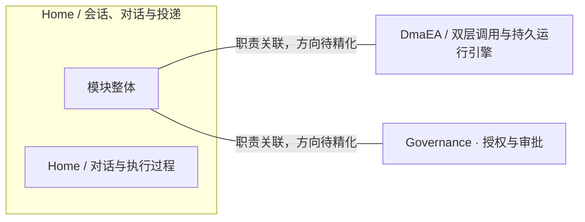

# Home / 会话、对话与投递：模块架构

模块ID：`APP-HOME` · 基线：2026-10-05，b6115e6 + 当前工作树。

这是总图的**模块职责投影**：实线无箭头表示相关职责，不表示调用先后。逐模块审计任务将补充成功/失败、控制流、数据流和恢复关系；仅ProjectReference箭头表示已从工程文件读出的编译依赖。

## 可编辑架构图

## 模块边界与输入/输出

| 职责 | 当前边界 | 来源 |
| --- | --- | --- |
| Home / 对话与执行过程 | 发送用户意图，展示按 run 归属的模型流、执行活动与可裁决审批；HomeController 负责前端交互协调。 | [apps/desktop/src/controllers/HomeController.ts:22](../../../../../apps/desktop/src/controllers/HomeController.ts#L22) |

## 继续精化时必须补齐

- 实际入口、调用方向与状态所有者；每个有向关系有源码依据。
- 成功与错误/取消路径、身份/权限边界、异步与恢复时序。
- 哪些是Core内部端口、哪些跨进程/HTTP/stdio，哪些仅是UI职责关联。
- 已确认缺口使用不同标记；目标图与当前图分别说明，避免合并成假现状。

任务入口：[APP-HOME-001](TODO.md#app-home-001)。
