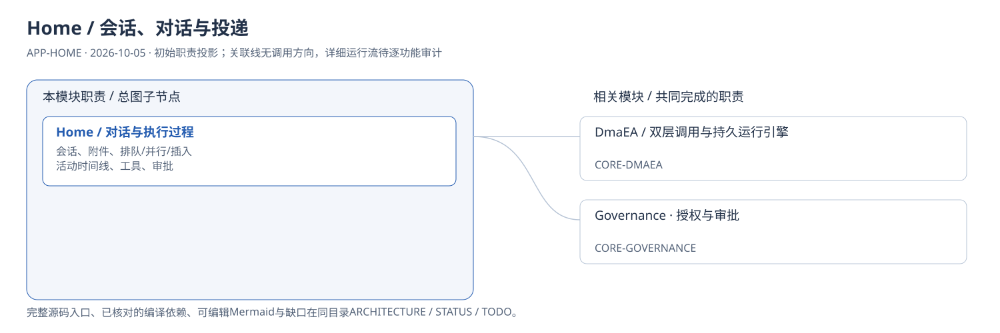
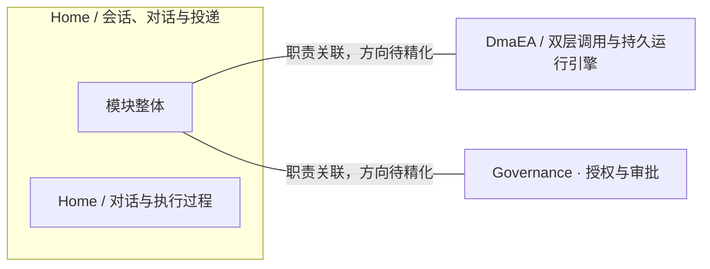
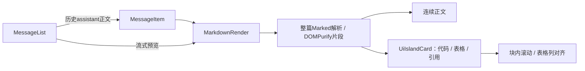

# Home / 会话、对话与投递：模块架构

## 工作区目录与交互（2026-10-10）

下图表示本轮实际调用与状态归属。新建/编辑统一窗口，项目行折叠留在本机列表，不触发业务上下文切换；运行与工具冻结归 Core。契约及唯一任务见 [APP-HOME-107](TODO.md#app-home-107)。

```mermaid
flowchart LR
  nav["UIE NavCard / AppSidebar / Composer"] --> home["HomeController 新对话上下文"]
  nav --> list["useWorkspaceList 本机显示与手动顺序"]
  home --> dialog["WorkspaceEditorDialog / ReKa"]
  dialog --> ipc["可信 Electron 目录多选 IPC"]
  dialog --> api["Desktop API / 固定 scope / If-Match"]
  api --> gateway["Gateway 薄代理"]
  gateway --> registry["StorageScopeRegistry / WorkspaceRegistry"]
  registry --> manifest["project.toml 条件原子保存"]
  registry --> grants["用户根 宿主当前与历史目录授权"]
  registry --> graph["每作用域独立 Core 图与项目投影"]
  graph --> admission["新运行 冻结 scope / roots / primary / policy"]
  admission --> tools["按冻结目录集合隔离的 Tools 进程"]
  tools --> files["文件 / 搜索 / Shell / Git"]
  graph --> snapshots["目录 ID + 相对路径的多目录快照"]
```

实现来源：AppSidebar.vue、useWorkspaceList.ts、HomeController.ts、WorkspaceEditorDialog.vue、workspaceFolders.cjs、StorageScopeEndpoints.cs、StorageScopeRegistry.Workspaces.cs、ToolConfigurationResolver.cs、TinadecToolsProcessManager.cs 和 WorkspaceBundleSnapshotProvider.cs。存储锚点固定为创建时的主目录；更换主要目录仅影响新上下文，已存在终端、运行与流继续保有自己的绑定。

## 输入框命令与运行设置（2026-10-08）

ComposerBar的+、slash和工具栏共用ComposerCommandPanel。HomeController保存配置到Core并持有服务器回执；ChatCard/ChatPanel与SpatialPage读取同一设置。发送捕获选项后进入interaction/队列，Core在准入组合发布资源并冻结，模型和工具不读取后来修改的前端选项。标题和设置写入按会话串行、revision防冲突；异步队列操作保留来源会话。详见[实施记录](../../../../../.tinadec_dev/reports/2026-10-08-command-panel.zh-CN.md)。

模块ID：`APP-HOME` · 基线：2026-10-05，b6115e6 + 当前工作树。



这是总图的**模块职责投影**：实线无箭头表示相关职责，不表示调用先后。逐模块审计任务将补充成功/失败、控制流、数据流和恢复关系；仅ProjectReference箭头表示已从工程文件读出的编译依赖。

## 可编辑架构图



## 模块边界与输入/输出

| 职责 | 当前边界 | 来源 |
| --- | --- | --- |
| Home / 对话与执行过程 | 发送用户意图，展示按 run 归属的模型流、执行活动与可裁决审批；HomeController 负责前端交互协调。 | [apps/desktop/src/controllers/HomeController.ts:22](../../../../../apps/desktop/src/controllers/HomeController.ts#L22) |

## 继续精化时必须补齐

- 实际入口、调用方向与状态所有者；每个有向关系有源码依据。
- 成功与错误/取消路径、身份/权限边界、异步与恢复时序。
- 哪些是Core内部端口、哪些跨进程/HTTP/stdio，哪些仅是UI职责关联。
- 已确认缺口使用不同标记；目标图与当前图分别说明，避免合并成假现状。

任务入口：[APP-HOME-001](TODO.md#app-home-001)。

## Markdown 正文局部渲染流（2026-10-07）

以下箭头是已从组件源码核对的渲染与数据顺序，不改变上方模块职责关联图。功能与验收由 [APP-HOME-103](TODO.md#app-home-103) 持有。



来源：[MessageList.vue](../../../../../apps/desktop/src/components/MessageList.vue)、[MessageItem.vue](../../../../../apps/desktop/src/components/MessageItem.vue)、[MarkdownRender.vue](../../../../../apps/desktop/src/components/MarkdownRender.vue)、[UiIslandCard](../../../../../apps/desktop/src/components/ui/island-card.vue)、[全局样式](../../../../../apps/desktop/src/styles.css)。用户消息仍为文本插值；Core继续拥有持久消息与模型流，Desktop仅负责正文展示。已完成块的HTML不变时，Vue保留其DOM与表格焦点；未完成块继续更新。
