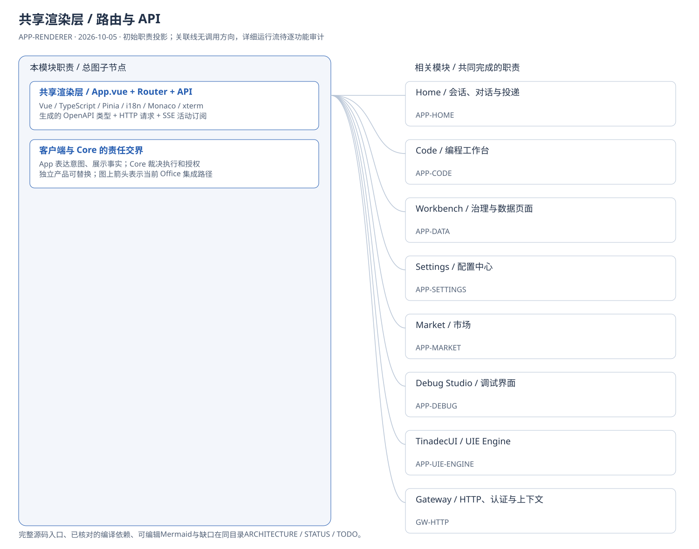
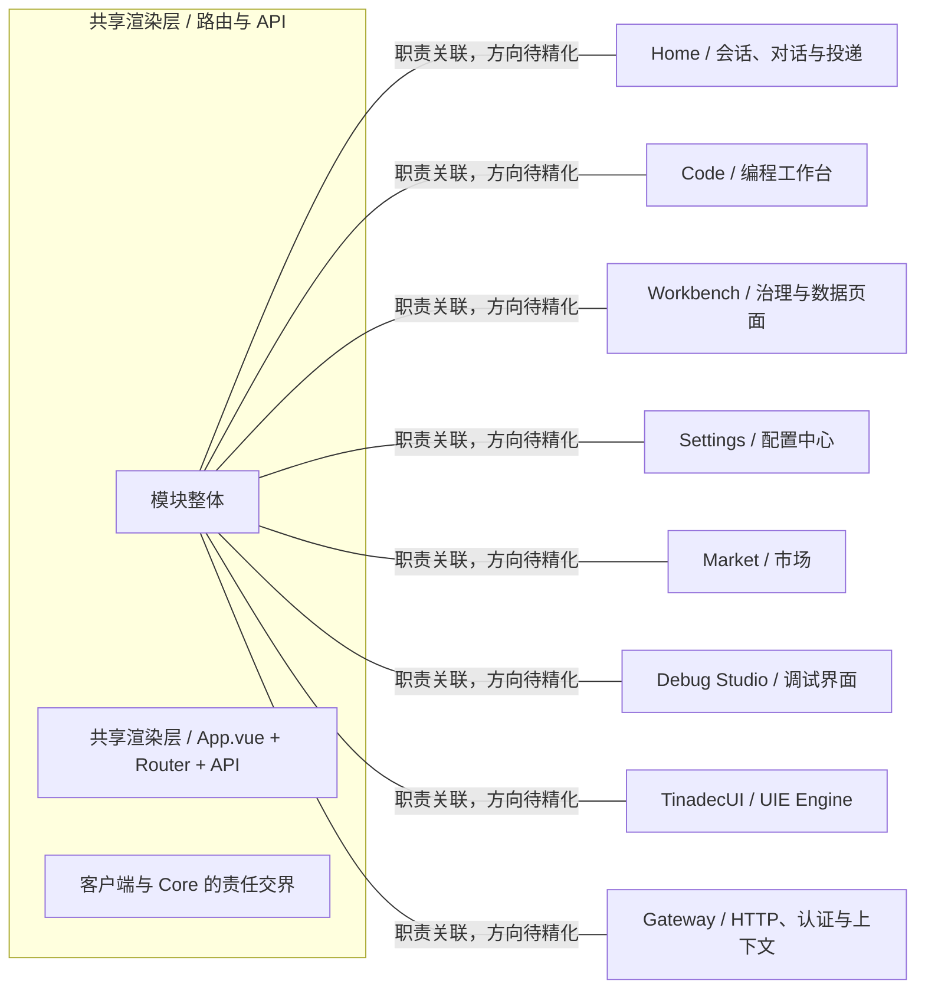
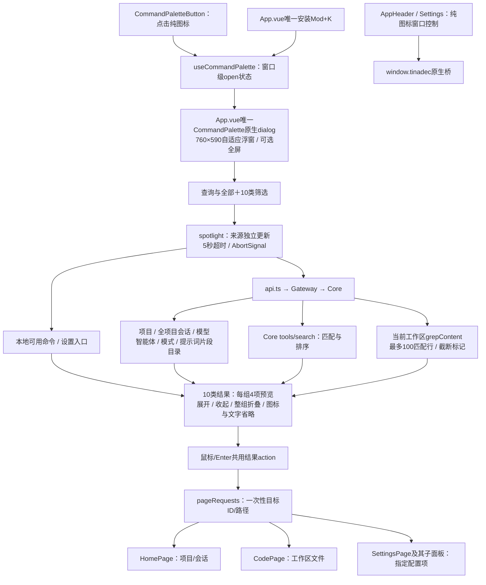

# 共享渲染层 / 路由与 API：模块架构

模块ID：`APP-RENDERER` · 初始职责图基线：2026-10-05，b6115e6；搜索运行流核对：2026-10-06，905d003 + 当前工作树。

这是总图的**模块职责投影**：实线无箭头表示相关职责，不表示调用先后。逐模块审计任务将补充成功/失败、控制流、数据流和恢复关系；仅ProjectReference箭头表示已从工程文件读出的编译依赖。

## 可编辑架构图

## 模块边界与输入/输出

| 职责 | 当前边界 | 来源 |
| --- | --- | --- |
| 共享渲染层 / App.vue + Router + API | 组合页面、状态、路由、通知与 API 客户端，展示 Core 返回的状态。 | [apps/desktop/src/main.ts](../../../../../apps/desktop/src/main.ts) |
| 客户端与 Core 的责任交界 | 四产品可独立版本化和组合。当前桌面/Web 渲染层经 Gateway 使用 Core，不意味着所有产品必须捆绑安装。 | [docs/tinadec-core-product-definition.zh-CN.md:97](../../../../tinadec-core-product-definition.zh-CN.md#L97) |

## 分类搜索与窗口控制运行流（2026-10-06）

下面是当前搜索专项的有向运行流；上方职责总图继续保留，不表示整个共享渲染层已完成审计。

| 有向关系 | 源码依据与责任 |
| --- | --- |
| 入口/快捷键 → 窗口级dialog | [CommandPaletteButton.vue](../../../../../apps/desktop/src/components/CommandPaletteButton.vue)、[useCommandPalette.ts](../../../../../apps/desktop/src/composables/useCommandPalette.ts)、[App.vue](../../../../../apps/desktop/src/App.vue)：入口只打开状态，App拥有唯一面板和快捷键安装。 |
| 查询 → 各来源 → 分类结果 | [CommandPalette.vue](../../../../../apps/desktop/src/components/CommandPalette.vue)、[spotlight.ts](../../../../../apps/desktop/src/lib/spotlight.ts)、[api.ts](../../../../../apps/desktop/src/api.ts)：渲染层聚合目录和结果，Core拥有工具与内容检索；失败来源单独保留提示，不阻塞其他结果。 |
| 结果动作 → 精确页面目标 | [pageRequests.ts](../../../../../apps/desktop/src/lib/pageRequests.ts)、[HomePage.vue](../../../../../apps/desktop/src/pages/HomePage.vue)、[CodePage.vue](../../../../../apps/desktop/src/pages/CodePage.vue)、[SettingsPage.vue](../../../../../apps/desktop/src/pages/SettingsPage.vue)：请求写入目标ID/路径后导航，页面一次性消费；模式/提示词/工具由对应设置子面板定位。 |
| 纯图标控件 → 窗口桥 | [AppHeader.vue](../../../../../apps/desktop/src/components/AppHeader.vue)、[styles.css](../../../../../apps/desktop/src/styles.css)、[SettingsPage.vue](../../../../../apps/desktop/src/pages/SettingsPage.vue)：主界面与设置页共享透明/无阴影36×32控制样式，原生IPC所有者见Desktop模块。 |

边界：会话按标题与项目名匹配，不读取历史消息全文；文件内容只搜当前工作区，不是全磁盘文件名索引。来源超时/取消保护仅为搜索专项，不能替代[APP-RENDERER-101](TODO.md#app-renderer-101)全局取消语义复验。

专项功能：[APP-RENDERER-F002](STATUS.md)；专项任务：[APP-RENDERER-103](TODO.md#app-renderer-103)。

## 继续精化时必须补齐

- 实际入口、调用方向与状态所有者；每个有向关系有源码依据。
- 成功与错误/取消路径、身份/权限边界、异步与恢复时序。
- 哪些是Core内部端口、哪些跨进程/HTTP/stdio，哪些仅是UI职责关联。
- 已确认缺口使用不同标记；目标图与当前图分别说明，避免合并成假现状。

任务入口：[APP-RENDERER-001](TODO.md#app-renderer-001)。
