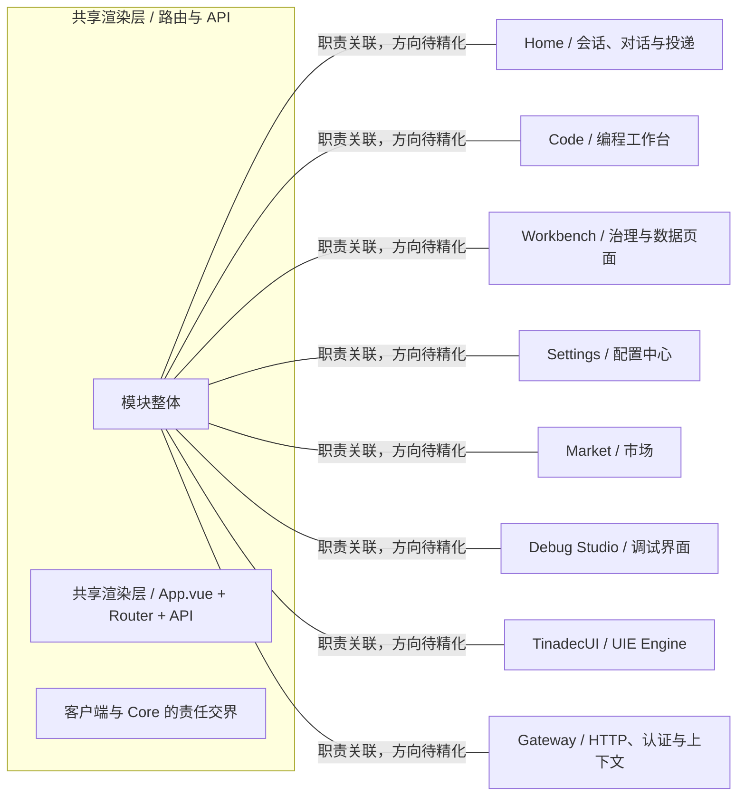

# 共享渲染层 / 路由与 API：模块架构

模块ID：`APP-RENDERER` · 基线：2026-10-05，b6115e6 + 当前工作树。

这是总图的**模块职责投影**：实线无箭头表示相关职责，不表示调用先后。逐模块审计任务将补充成功/失败、控制流、数据流和恢复关系；仅ProjectReference箭头表示已从工程文件读出的编译依赖。

## 可编辑架构图

## 模块边界与输入/输出

| 职责 | 当前边界 | 来源 |
| --- | --- | --- |
| 共享渲染层 / App.vue + Router + API | 组合页面、状态、路由、通知与 API 客户端，展示 Core 返回的状态。 | [apps/desktop/src/main.ts](../../../../../apps/desktop/src/main.ts) |
| 客户端与 Core 的责任交界 | 四产品可独立版本化和组合。当前桌面/Web 渲染层经 Gateway 使用 Core，不意味着所有产品必须捆绑安装。 | [docs/tinadec-core-product-definition.zh-CN.md:97](../../../../tinadec-core-product-definition.zh-CN.md#L97) |

## 继续精化时必须补齐

- 实际入口、调用方向与状态所有者；每个有向关系有源码依据。
- 成功与错误/取消路径、身份/权限边界、异步与恢复时序。
- 哪些是Core内部端口、哪些跨进程/HTTP/stdio，哪些仅是UI职责关联。
- 已确认缺口使用不同标记；目标图与当前图分别说明，避免合并成假现状。

任务入口：[APP-RENDERER-001](TODO.md#app-renderer-001)。
