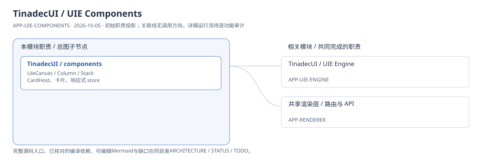
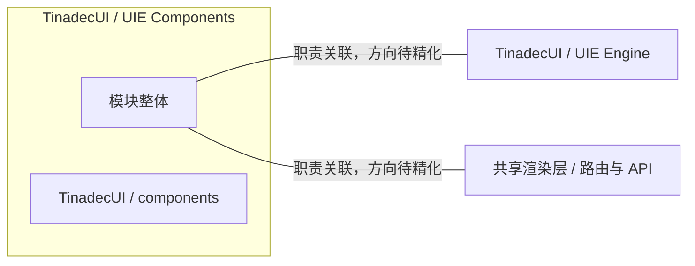

# TinadecUI / UIE Components：模块架构

模块ID：`APP-UIE-COMPONENTS` · 基线：2026-10-05，b6115e6 + 当前工作树。

这是总图的**模块职责投影**：实线无箭头表示相关职责，不表示调用先后。逐模块审计任务将补充成功/失败、控制流、数据流和恢复关系；仅ProjectReference箭头表示已从工程文件读出的编译依赖。

## 可编辑架构图

## 模块边界与输入/输出

| 职责 | 当前边界 | 来源 |
| --- | --- | --- |
| TinadecUI / components | Vue组件单向依赖engine。16卡型（新增 spatialWork）：nav/chat/homePicker/git/approval/orchestration/organization/events/doctor/browser/agent/terminal/marketFilter/marketCatalog/marketDetail。classic/Vapor是渲染实现细节。 | [apps/TinadecUI/src/index.ts:6](../../../../../apps/TinadecUI/src/index.ts#L6) |

## 继续精化时必须补齐

- 实际入口、调用方向与状态所有者；每个有向关系有源码依据。
- 成功与错误/取消路径、身份/权限边界、异步与恢复时序。
- 哪些是Core内部端口、哪些跨进程/HTTP/stdio，哪些仅是UI职责关联。
- 已确认缺口使用不同标记；目标图与当前图分别说明，避免合并成假现状。

任务入口：[APP-UIE-COMPONENTS-001](TODO.md#app-uie-components-001)。

## 2026-10-06 空间模式数据流

`SpatialPage` 读取既有会话消息、拓扑与活动，投影稳定工作对象 ID；UIE 的 `space` 分支只保存 sessionId、对象几何和视口。Vue Flow 的拖动/尺寸/视口事件通过命令总线提交，`layerStore` 写入 `sessionBySessionId`，沿已有 Electron IPC 保存。画布宿主与预览读取同一对象；预览点击只定位。

来源：[空间首批报告](../../../../../.tinadec_dev/reports/2026-10-06-spatial-mode-first-slice.zh-CN.md)。完整执行能力组合仍由 [APP-RENDERER-104](../shared-renderer/TODO.md#app-renderer-104) 跟踪。
