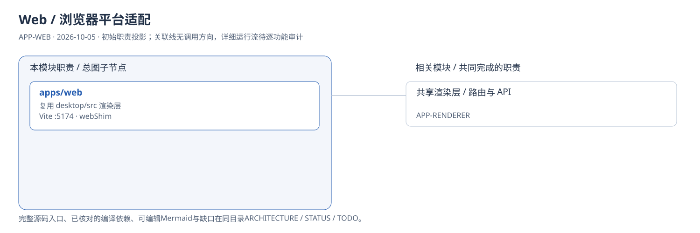
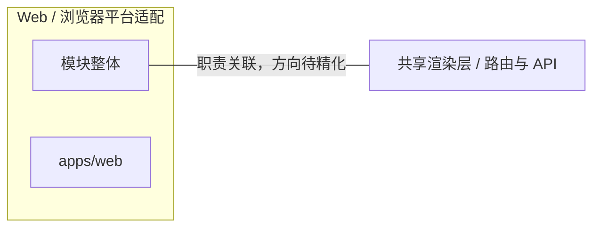

# Web / 浏览器平台适配：模块架构

模块ID：`APP-WEB` · 基线：2026-10-05，b6115e6 + 当前工作树。

这是总图的**模块职责投影**：实线无箭头表示相关职责，不表示调用先后。逐模块审计任务将补充成功/失败、控制流、数据流和恢复关系；仅ProjectReference箭头表示已从工程文件读出的编译依赖。

## 可编辑架构图

## 模块边界与输入/输出

| 职责 | 当前边界 | 来源 |
| --- | --- | --- |
| apps/web | Web 使用与 Desktop 相同的业务组件与路由，由 webShim 适配平台契约。目前没有本地PTY、桌宠、分离窗口、原生目录选择，也没有Electron磁盘布局adapter。 | [apps/web/vite.config.ts:10](../../../../../apps/web/vite.config.ts#L10) |

## 继续精化时必须补齐

- 实际入口、调用方向与状态所有者；每个有向关系有源码依据。
- 成功与错误/取消路径、身份/权限边界、异步与恢复时序。
- 哪些是Core内部端口、哪些跨进程/HTTP/stdio，哪些仅是UI职责关联。
- 已确认缺口使用不同标记；目标图与当前图分别说明，避免合并成假现状。

任务入口：[APP-WEB-001](TODO.md#app-web-001)。
