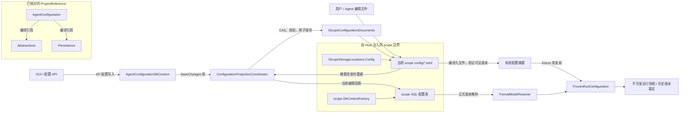

# AgentConfiguration：模块架构

模块ID：`CORE-AGENT-CONFIG` · 更新：2026-10-09，b6115e6 + 当前工作树。

当前已核对配置编辑、投影和运行冻结链路。下图箭头表示对应源码的调用/数据流；包安装/清理其余路径仍列在 F001 的审计边界，不从配置测试推断整体完成。

## 可编辑架构图

## 模块边界与输入/输出

| 职责 | 当前边界 | 来源 |
| --- | --- | --- |
| AgentConfiguration | 管理智能体与模式版本、包归属与启禁、安装预览和清理；正式版本以不可变快照参与运行。 | [AgentConfigurationModuleRegistrar](../../../../../TinadecCore/AgentConfiguration/AgentConfigurationModuleRegistrar.cs) |
| 文件来源和并发 | `agents.toml`、`models.toml`、`tools.toml`、`mcp.toml`、`prompts.toml`、`skills.toml`、`runtime.toml`、`storage.toml`、`logging.toml` 位于当前 scope Config；writer lock 位于 State。读写均不使用 CWD 或用户 scope fallback。保存接受预期 SHA256；错误诊断包含代码、消息、行列。 | [ScopeConfigurationDocuments](../../../../../TinadecCore/Persistence/Configuration/ScopeConfigurationDocuments.cs) |
| 原生绑定与 DTO | 活动 MCP/Skills binding 使用 inherit/all/none/selected，只有 selected 携带 ids；可选值使用 unlimited/outer_deadline/host_search。GUI/API 稀疏 JSON 经统一 codec 投影，不把 null 哨兵写入活动文件；历史 JSON 保持原字节。 | [ConfigurationTomlValues](../../../../../TinadecCore/Persistence/Configuration/ConfigurationTomlValues.cs) |
| 编辑投影和历史 | 五个配置 DbContext 的 SaveChanges 先保存 TOML。文件变化后创建工厂触发投影重建；当前可编辑行可以删除重建，历史版本保留/退休。当前绑定必须引用 TOML 中可见版本，禁止以旧 SQL 行充当当前配置。 | [ConfigurationProjectionDbContext](../../../../../TinadecCore/Persistence/Configuration/ConfigurationProjectionDbContext.cs) [ConfigurationProjectionCoordinator](../../../../../TinadecCore/Persistence/Configuration/ConfigurationProjectionCoordinator.cs) |
| 正文与项目复制 | 文件携带所引用 config/content/manifest 正文及不可变相对引用；在目标 scope IContentStore 校验与物化。复制项目配置不需要复制用户会话、数据库或日志。 | [ConfigurationProjectionDocumentValidator](../../../../../TinadecCore/Persistence/Configuration/ConfigurationProjectionDocumentValidator.cs) |
| 准入与冻结 | 新 run 编译全部当前配置、校验类型/当前版本/实际 backend，然后冻结前复核摘要。连接期 backend/ref 与文件不符时返回 `configuration_restart_required`，Host 显式 apply/reopen；不会运行中热切 DbContext。 | [FrozenRunConfiguration](../../../../../TinadecCore/DmaEA/FrozenRunConfiguration.cs) [ConfigurationLiveSourceValidation](../../../../../TinadecCore/Persistence/Configuration/ConfigurationLiveSourceValidation.cs) |

## 失败与恢复边界

非法 TOML、语义错误、陈旧 CAS 或不可变版本内容冲突拒绝保存，保持旧文件。文件保存先于 SQL；SQL 失败后的文件仍是权威，下次 Reconcile 从已保存文件重建编辑投影。文件/SQL 两者之间不声称跨介质事务。不同进程的 writer lock 通过 State 文件共享，项目 Config 保持可版本控制。

首次文件建立后，State 保存生命周期标记。删除整个文件返回 `configuration_missing`；SQL 非空时也禁止重新 seed，避免数据库历史复活已删除编辑态。恢复原文件或 CAS 保存有效替代文件后投影恢复；数据库历史保持完整。

SQL 历史版本、冻结 run 配置和运行事实不因文件删除被清除。新运行只能从当前文件定义构建，历史回放读取其已冻结引用。自由会话迁移另由 Runtime 保存 source 配置归档与事实图，未来运行重绑目标 published defaults，不用 source 文件覆盖目标编辑态。

Runtime 来源由配置编辑权威端口区分：托管 graph 的 `IScopeConfigurationDocuments` 存在时，严格要求本 scope runtime 文件；只注册 Persistence 的嵌入宿主使用显式 Profile 或随包基线，不写用户配置，也不因 locations 存在自动进入托管模式。来源选择 3 项与原有 SkillFactory 的实际 HTTP 1 项回归均通过，见 [来源验证报告](../../../../../.tinadec_dev/reports/2026-10-09-runtime-configuration-source.zh-CN.md)。

## 源码与验证边界

[定向验证报告](../../../../../.tinadec_dev/reports/2026-10-09-configuration-files.zh-CN.md) 记录本轮 Windows/SQLite 的保存失败、注释、投影、历史版本、准入摘要和项目正文重建测试。[Linux 实测报告](../../../../../.tinadec_dev/reports/2026-10-09-linux-postgresql-validation.zh-CN.md) 记录 Fedora 44 上全 22 项通过，包含真实 PostgreSQL 十二 DbContext 双 schema 隔离。后续 [原生绑定差分](../../../../../.tinadec_dev/reports/2026-10-09-native-toml-bindings.zh-CN.md) 的 Windows 配置 19/19、Linux 配置与真实 PG 20/20 均无 skip，取代旧证据的活动配置形状边界。缺少显式数据库环境时 PostgreSQL 测试显示 skip；macOS 实际运行仍列在 [CORE-AGENT-CONFIG-003](TODO.md#core-agent-config-003)。

## 已核对的编译引用

工程文件：[TinadecCore/AgentConfiguration/TinadecCore.AgentConfiguration.csproj](../../../../../TinadecCore/AgentConfiguration/TinadecCore.AgentConfiguration.csproj)。

- Abstractions
- Persistence

## 其余模块审计仍需补齐

- 实际入口、调用方向与状态所有者；每个有向关系有源码依据。
- 成功与错误/取消路径、身份/权限边界、异步与恢复时序。
- 哪些是Core内部端口、哪些跨进程/HTTP/stdio，哪些仅是UI职责关联。
- 已确认缺口使用不同标记；目标图与当前图分别说明，避免合并成假现状。

任务入口：[CORE-AGENT-CONFIG-001](TODO.md#core-agent-config-001)。
