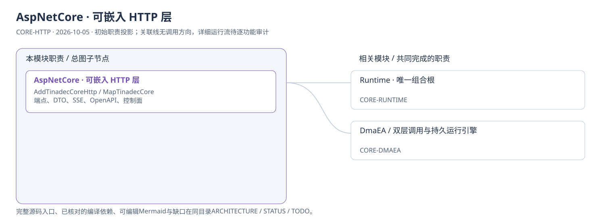
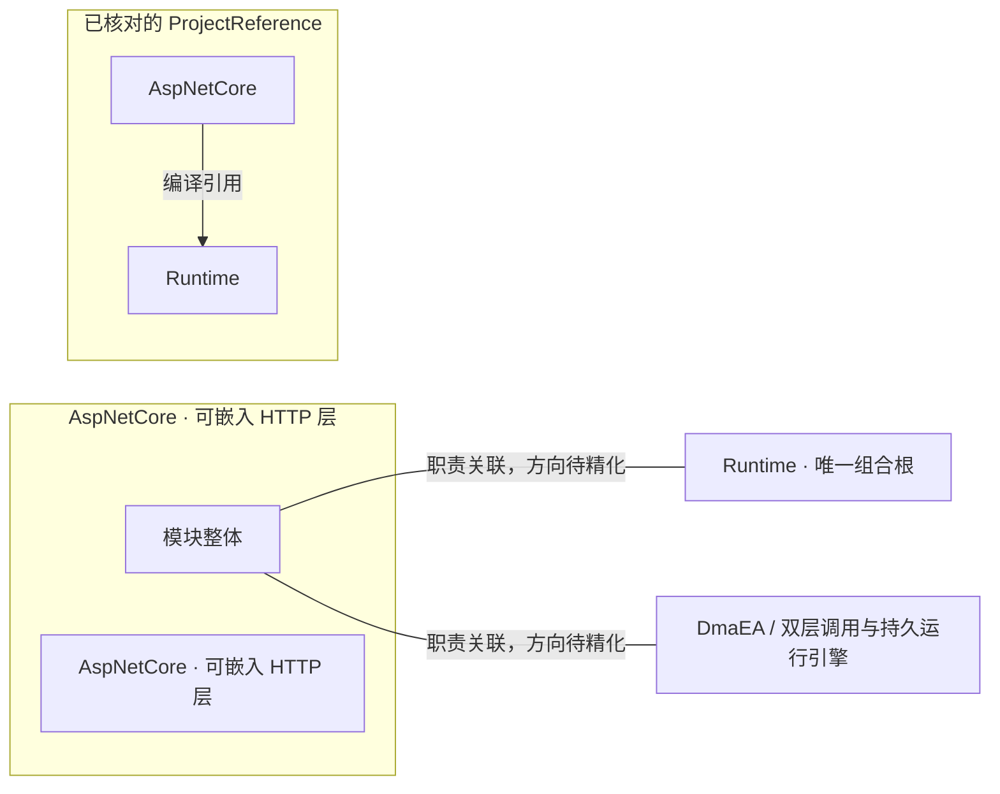

# AspNetCore · 可嵌入 HTTP 层：模块架构

模块ID：`CORE-HTTP` · 基线：2026-10-05，b6115e6 + 当前工作树。

这是总图的**模块职责投影**：实线无箭头表示相关职责，不表示调用先后。逐模块审计任务将补充成功/失败、控制流、数据流和恢复关系；仅ProjectReference箭头表示已从工程文件读出的编译依赖。

## 可编辑架构图

## 模块边界与输入/输出

| 职责 | 当前边界 | 来源 |
| --- | --- | --- |
| AspNetCore · 可嵌入 HTTP 层 | 提供可以挂载到其它 ASP.NET Core 应用的 HTTP 层，引用 Runtime。端点实现现已在此模块。 | [TinadecCore/AspNetCore/TinadecCore.AspNetCore.csproj](../../../../../TinadecCore/AspNetCore/TinadecCore.AspNetCore.csproj) |

## 已核对的编译引用

2026-10-10 工作区读路径补充：`StorageScopeEndpoints` → 注册表的只读 `ReadWorkspace` → `StorageScopeRowError` → 每条 DTO；`StorageEndpoints` → 逐作用域运行图租约 → 实际项目数据库记录。行级捕获保留其他工作区，取消与致命错误上抛。数据库错误通过 `ServerFailureJournal` 留内部证据，不输出 SQL/driver。ProblemDetails 的分类由 `TinadecCoreHttpExtensions` 统一补齐；已带 trace 的响应通过 `TracePreservingProblemDetailsWriter` 避免框架提前覆盖。该专项不改变既有 scope/宿主授权边界，任务与验收统一见 [APP-HOME-107](../../app/home/TODO.md#app-home-107) 和 [回归报告](../../../../../.tinadec_dev/reports/2026-10-10-interface-regression.zh-CN.md)。

工程文件：[TinadecCore/AspNetCore/TinadecCore.AspNetCore.csproj](../../../../../TinadecCore/AspNetCore/TinadecCore.AspNetCore.csproj)。

- Runtime

## 继续精化时必须补齐

- 实际入口、调用方向与状态所有者；每个有向关系有源码依据。
- 成功与错误/取消路径、身份/权限边界、异步与恢复时序。
- 哪些是Core内部端口、哪些跨进程/HTTP/stdio，哪些仅是UI职责关联。
- 已确认缺口使用不同标记；目标图与当前图分别说明，避免合并成假现状。

任务入口：[CORE-HTTP-001](TODO.md#core-http-001)。

会话创建与清除默认模式的 agent_mode_not_configured 拒绝统一返回409 ProblemDetails，保留原message，并由现有分类端口提供open_settings与trace；准入与默认选择不变。隔离真实HTTP单例验证失败不新增会话、不修改已有标题/冻结模式/设置revision，证据见[补强记录](../../../../../.tinadec_dev/evidence/2026-10-10-interface-regression/core-agent-mode-errors.md)。
