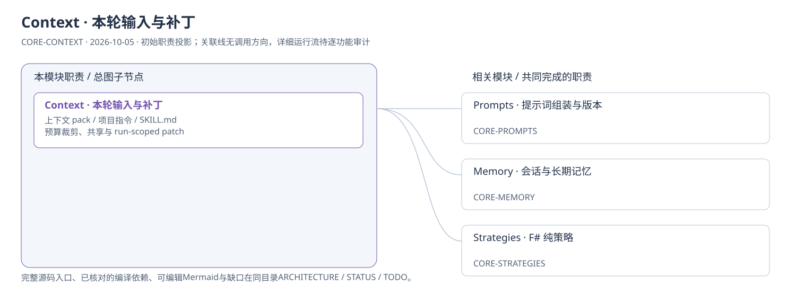
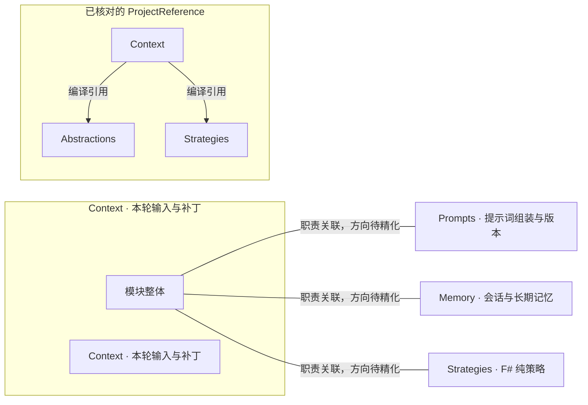

# Context · 本轮输入与补丁：模块架构

模块ID：`CORE-CONTEXT` · 基线：2026-10-05，b6115e6 + 当前工作树。

这是总图的**模块职责投影**：实线无箭头表示相关职责，不表示调用先后。逐模块审计任务将补充成功/失败、控制流、数据流和恢复关系；仅ProjectReference箭头表示已从工程文件读出的编译依赖。

## 可编辑架构图

## 模块边界与输入/输出

| 职责 | 当前边界 | 来源 |
| --- | --- | --- |
| Context · 本轮输入与补丁 | 准备本轮模型输入，读取项目指令与实际工作区 skill 文件，分配上下文预算并应用安全边界补丁。完整事件驱动压缩尚未闭环。 | [TinadecCore/Context/ContextModuleRegistrar.cs](../../../../../TinadecCore/Context/ContextModuleRegistrar.cs) |

## 已核对的编译引用

工程文件：[TinadecCore/Context/TinadecCore.Context.csproj](../../../../../TinadecCore/Context/TinadecCore.Context.csproj)。

- Abstractions
- Strategies

## 继续精化时必须补齐

- 实际入口、调用方向与状态所有者；每个有向关系有源码依据。
- 成功与错误/取消路径、身份/权限边界、异步与恢复时序。
- 哪些是Core内部端口、哪些跨进程/HTTP/stdio，哪些仅是UI职责关联。
- 已确认缺口使用不同标记；目标图与当前图分别说明，避免合并成假现状。

任务入口：[CORE-CONTEXT-001](TODO.md#core-context-001)。
