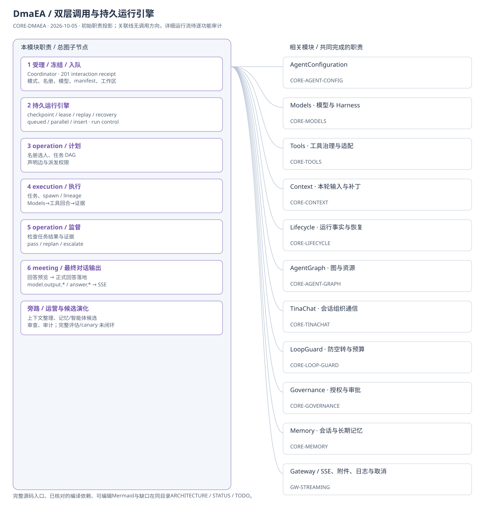
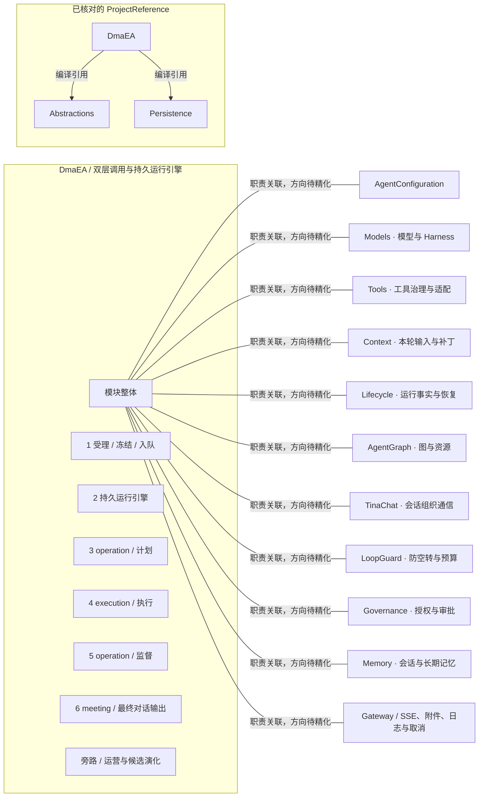

# DmaEA / 双层调用与持久运行引擎：模块架构

模块ID：`CORE-DMAEA` · 基线：2026-10-05，b6115e6 + 当前工作树。

这是总图的**模块职责投影**：实线无箭头表示相关职责，不表示调用先后。逐模块审计任务将补充成功/失败、控制流、数据流和恢复关系；仅ProjectReference箭头表示已从工程文件读出的编译依赖。

## 可编辑架构图

## 模块边界与输入/输出

| 职责 | 当前边界 | 来源 |
| --- | --- | --- |
| 1 受理 / 冻结 / 入队 | 受理用户消息，创建运行/turn，冻结配置与工作区事实，交给持久引擎。运行过程中不临时重新读可变配置。 | [TinadecCore/DmaEA/FullDuplexRunCoordinator.cs:241](../../../../../TinadecCore/DmaEA/FullDuplexRunCoordinator.cs#L241) |
| 2 持久运行引擎 | 推动运行阶段，保存 checkpoint、管理运行租约、处理中断与安全边界上下文补丁。任务级工具并发切片已存在，独立执行子 run 尚未闭环。 | [TinadecCore/DmaEA/FullDuplexRunEngine.cs:664](../../../../../TinadecCore/DmaEA/FullDuplexRunEngine.cs#L664) |
| 3 operation / 计划 | 按冻结名册和模式职责生成任务图与明确assignee。operation角色可按配置拥有工具面，工具调用仍受manifest、grant及授权约束；不是引擎永久禁止治理层持工具。 | [TinadecCore/DmaEA/PlanningAgent.cs](../../../../../TinadecCore/DmaEA/PlanningAgent.cs) |
| 4 execution / 执行 | 执行者按冻结工具与委派包络运行，通过Models调用模型，再使用Core Tools派发工具；可将任务派给许可目标，受深度、预算、资源及权限约束。task_dispatch仍向当前run添加任务。 | [TinadecCore/DmaEA/FullDuplexRunEngine.cs](../../../../../TinadecCore/DmaEA/FullDuplexRunEngine.cs) |
| 5 operation / 监督 | 监督阶段根据事实裁决，重规划继续或升级为 awaiting_user，由用户裁决后恢复。失败任务与未决任务分别记账。 | [TinadecCore/DmaEA/FullDuplexRunEngine.cs](../../../../../TinadecCore/DmaEA/FullDuplexRunEngine.cs) |
| 6 meeting / 最终对话输出 | 对话身份以执行结果和监督事实形成最终答复。提供方未完成时可先发公开推理/回答预览；正式回答在裁决后落地并替换预览。 | [TinadecCore/DmaEA/ModelOutputStream.cs](../../../../../TinadecCore/DmaEA/ModelOutputStream.cs) |
| 旁路 / 运营与候选演化 | 运行生命周期在多个anchor触发上下文整理/能力顾问等运营角色，完成阶段可生成记忆/智能体候选。完整演化评估、晋升与canary生命周期未闭环。 | [TinadecCore/DmaEA/DmaEAModuleRegistrar.cs](../../../../../TinadecCore/DmaEA/DmaEAModuleRegistrar.cs) |

## 已核对的编译引用

工程文件：[TinadecCore/DmaEA/TinadecCore.DmaEA.csproj](../../../../../TinadecCore/DmaEA/TinadecCore.DmaEA.csproj)。

- Abstractions
- Persistence

## 继续精化时必须补齐

- 实际入口、调用方向与状态所有者；每个有向关系有源码依据。
- 成功与错误/取消路径、身份/权限边界、异步与恢复时序。
- 哪些是Core内部端口、哪些跨进程/HTTP/stdio，哪些仅是UI职责关联。
- 已确认缺口使用不同标记；目标图与当前图分别说明，避免合并成假现状。

任务入口：[CORE-DMAEA-001](TODO.md#core-dmaea-001)。
