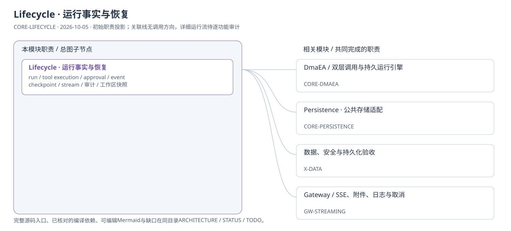
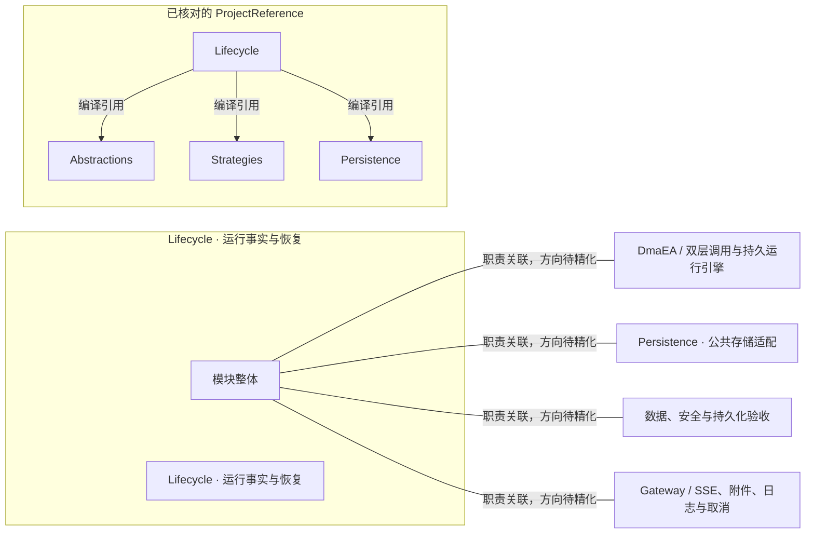

# Lifecycle · 运行事实与恢复：模块架构

模块ID：`CORE-LIFECYCLE` · 基线：2026-10-05，b6115e6 + 当前工作树。

这是总图的**模块职责投影**：实线无箭头表示相关职责，不表示调用先后。逐模块审计任务将补充成功/失败、控制流、数据流和恢复关系；仅ProjectReference箭头表示已从工程文件读出的编译依赖。

## 可编辑架构图

## 模块边界与输入/输出

2026-10-09：事件索引、checkpoint、approval、工具执行、模型调用和冻结配置归 mounted scope 的数据库与 `data/`；诊断日志另存 `logs/`，不把运行事实按容量轮转。跨模块永久删除和转移由 Runtime 组合，不让 Lifecycle 擅自删除共享资源。run 锁与恢复 worker 属于同一个 scope 服务图。

| 职责 | 当前边界 | 来源 |
| --- | --- | --- |
| Lifecycle · 运行事实与恢复 | 保存运行事实、事件与控制记录，支撑SSE回放和恢复判断；turn表属于Memory。父子run存储/级联控制基础已有，完整执行子run与恢复计划UX仍未闭环。 | [TinadecCore/Lifecycle/LifecycleModuleRegistrar.cs](../../../../../TinadecCore/Lifecycle/LifecycleModuleRegistrar.cs) |

## 已核对的编译引用

工程文件：[TinadecCore/Lifecycle/TinadecCore.Lifecycle.csproj](../../../../../TinadecCore/Lifecycle/TinadecCore.Lifecycle.csproj)。

- Abstractions
- Strategies
- Persistence

## 继续精化时必须补齐

- 实际入口、调用方向与状态所有者；每个有向关系有源码依据。
- 成功与错误/取消路径、身份/权限边界、异步与恢复时序。
- 哪些是Core内部端口、哪些跨进程/HTTP/stdio，哪些仅是UI职责关联。
- 已确认缺口使用不同标记；目标图与当前图分别说明，避免合并成假现状。

任务入口：[CORE-LIFECYCLE-001](TODO.md#core-lifecycle-001)。
