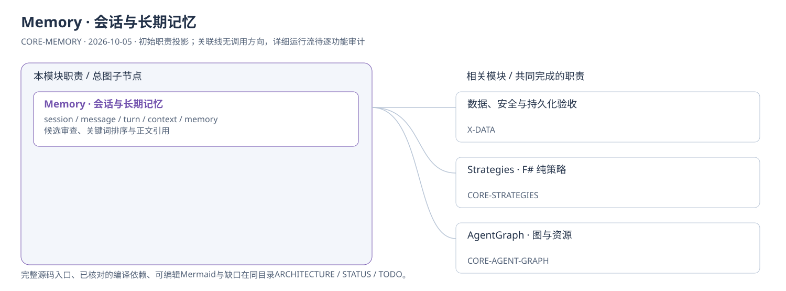
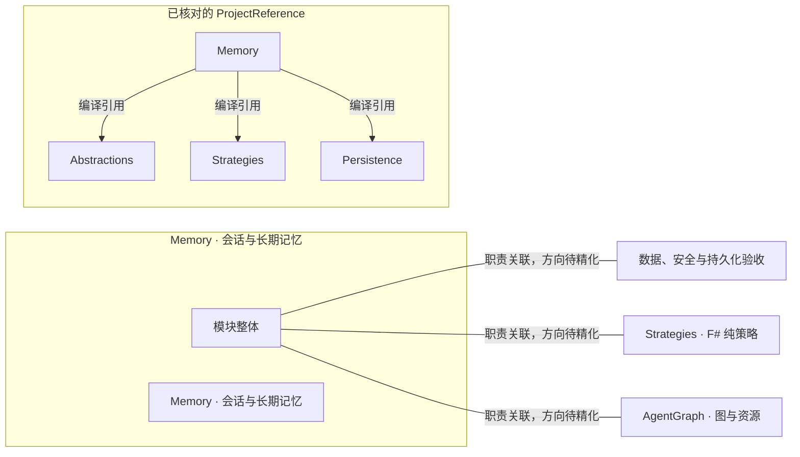

# Memory · 会话与长期记忆：模块架构

模块ID：`CORE-MEMORY` · 基线：2026-10-05，b6115e6 + 当前工作树。

这是总图的**模块职责投影**：实线无箭头表示相关职责，不表示调用先后。逐模块审计任务将补充成功/失败、控制流、数据流和恢复关系；仅ProjectReference箭头表示已从工程文件读出的编译依赖。

## 可编辑架构图

## 模块边界与输入/输出

| 职责 | 当前边界 | 来源 |
| --- | --- | --- |
| Memory · 会话与长期记忆 | 保存会话消息与长期记忆，和Context本轮输入组装不同。已审核记忆当前按关键词评分检索，没有接通向量检索；证据archive的混合检索在AgentGraph。 | [TinadecCore/Memory/MemoryModuleRegistrar.cs:43](../../../../../TinadecCore/Memory/MemoryModuleRegistrar.cs#L43) |

## 已核对的编译引用

工程文件：[TinadecCore/Memory/TinadecCore.Memory.csproj](../../../../../TinadecCore/Memory/TinadecCore.Memory.csproj)。

- Abstractions
- Strategies
- Persistence

## 继续精化时必须补齐

- 实际入口、调用方向与状态所有者；每个有向关系有源码依据。
- 成功与错误/取消路径、身份/权限边界、异步与恢复时序。
- 哪些是Core内部端口、哪些跨进程/HTTP/stdio，哪些仅是UI职责关联。
- 已确认缺口使用不同标记；目标图与当前图分别说明，避免合并成假现状。

任务入口：[CORE-MEMORY-001](TODO.md#core-memory-001)。

## 2026-10-06 会话类型

创建请求携带view_mode，Core Memory保存类型，StorageEndpoints投影，Gateway保留字段，HomeController按flat/space筛选与选择。类型固定于创建，历史null值对外为flat；UIE仍只保存布局。证据：[会话隔离报告](../../../../../.tinadec_dev/reports/2026-10-06-session-view-isolation.zh-CN.md)。
