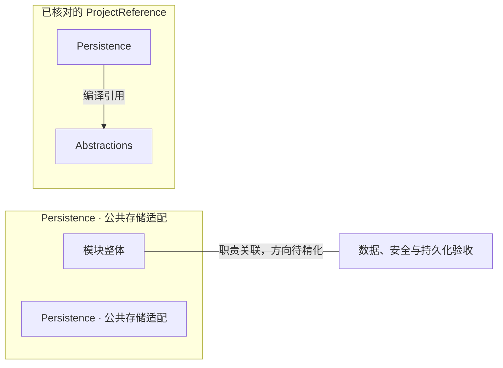

# Persistence · 公共存储适配：模块架构

模块ID：`CORE-PERSISTENCE` · 基线：2026-10-05，b6115e6 + 当前工作树。

这是总图的**模块职责投影**：实线无箭头表示相关职责，不表示调用先后。逐模块审计任务将补充成功/失败、控制流、数据流和恢复关系；仅ProjectReference箭头表示已从工程文件读出的编译依赖。

## 可编辑架构图

2026-10-09作用域适配：路径解析使用不可变`IScopeStorageLocations`且不创建目录，写入/初始化拥有创建职责。用户根持久UUID决定独立schema；每scope的连接、迁移history及EF模型缓存都从已冻结options取得，模型创建期间不调用`context.Database`。SQLite与向量库禁用连接池，生命周期结束后真实句柄释放；内容读写流持有租约。配置文件是编辑来源，DB保留历史事实及可重建投影。实际Linux/PG与Windows证据见[验收账本](../../../../../.tinadec_dev/evidence/2026-10-09-storage/VALIDATION.md)。

## 模块边界与输入/输出

| 职责 | 当前边界 | 来源 |
| --- | --- | --- |
| Persistence · 公共存储适配 | scope 路径、数据库/schema/model-cache 隔离、TOML配置文档/投影、内容流租约、密钥引用与 nonce；领域各自拥有 DbContext。 | [TinadecCore/Persistence/ServiceCollectionExtensions.cs](../../../../../TinadecCore/Persistence/ServiceCollectionExtensions.cs) [配置文档](CONFIGURATION-FILES.md) |

## 已核对的编译引用

工程文件：[TinadecCore/Persistence/TinadecCore.Persistence.csproj](../../../../../TinadecCore/Persistence/TinadecCore.Persistence.csproj)。

- Abstractions

## 继续精化时必须补齐

- 实际入口、调用方向与状态所有者；每个有向关系有源码依据。
- 成功与错误/取消路径、身份/权限边界、异步与恢复时序。
- 哪些是Core内部端口、哪些跨进程/HTTP/stdio，哪些仅是UI职责关联。
- 已确认缺口使用不同标记；目标图与当前图分别说明，避免合并成假现状。

任务入口：[CORE-PERSISTENCE-001](TODO.md#core-persistence-001)。
