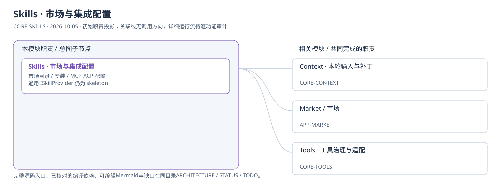
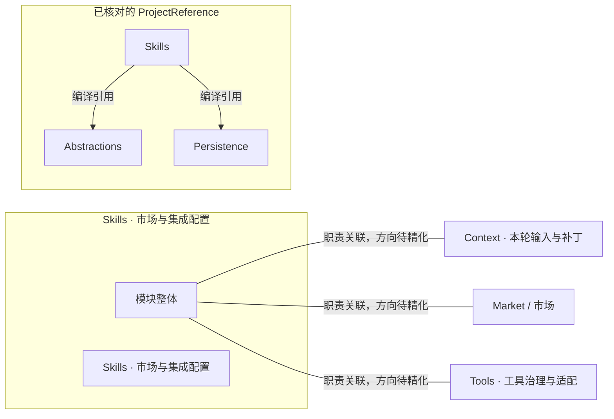
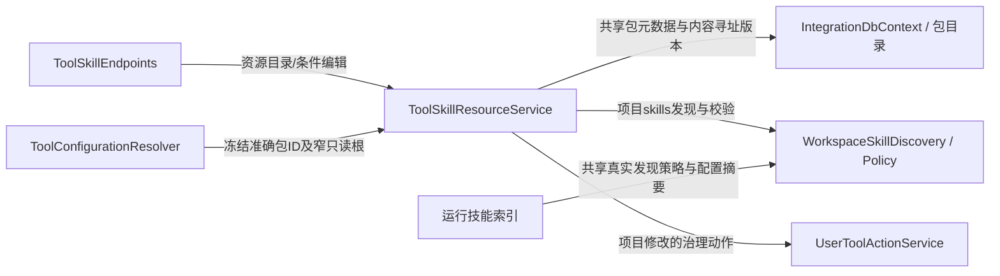
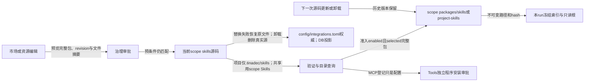

# Skills · 市场与集成配置：模块架构

模块ID：`CORE-SKILLS` · 基线：2026-10-05，b6115e6 + 当前工作树。

这是总图的**模块职责投影**：实线无箭头表示相关职责，不表示调用先后。逐模块审计任务将补充成功/失败、控制流、数据流和恢复关系；仅ProjectReference箭头表示已从工程文件读出的编译依赖。

## 可编辑架构图

## 模块边界与输入/输出

| 职责 | 当前边界 | 来源 |
| --- | --- | --- |
| Skills · 市场与集成配置 | 市场目录与受控安装、集成配置已实现；通用 ListSkillsAsync/GetSkillAsync 仍为空实现。实际工作区 SKILL.md 的读取在 Context。 | [TinadecCore/Skills/SkillsModuleRegistrar.cs:43](../../../../../TinadecCore/Skills/SkillsModuleRegistrar.cs#L43) |

## 已核对的编译引用

工程文件：[TinadecCore/Skills/TinadecCore.Skills.csproj](../../../../../TinadecCore/Skills/TinadecCore.Skills.csproj)。

- Abstractions
- Persistence

## 继续精化时必须补齐

- 实际入口、调用方向与状态所有者；每个有向关系有源码依据。
- 成功与错误/取消路径、身份/权限边界、异步与恢复时序。
- 哪些是Core内部端口、哪些跨进程/HTTP/stdio，哪些仅是UI职责关联。
- 已确认缺口使用不同标记；目标图与当前图分别说明，避免合并成假现状。

任务入口：[CORE-SKILLS-001](TODO.md#core-skills-001)。

## 2026-10-08 工具技能资源

箭头依据：[资源服务](../../../../../TinadecCore/Skills/ToolSkillResourceService.cs)、[发现](../../../../../TinadecCore/Abstractions/Ports/WorkspaceSkillDiscovery.cs)、[Context接线](../../../../../TinadecCore/Context/ContextModuleRegistrar.cs)、[配置解析](../../../../../TinadecCore/Tools/ToolConfigurationResolver.cs)。精确绑定失效不给同名替代；项目写入保留审批和哈希，共享正文/资产保留旧版本供运行继续读取。

## 2026-10-09 源码、版本与安装分离

管理读取 live 文件，Agent 可编辑配置与技能源码；源码字节变化更新条件修订，旧审阅不得覆盖新内容。运行准入才生成不可变副本，不从 live 目录继续读取。资源路径取 `IScopeStorageLocations.Root/Skills/Packages/Temp`，不将 `StoragePaths.Root`（Data）当包源。MCP程序目录和安装manifest由Tools拥有，市场预览不下载依赖。详见[实施与验证](../../../../../.tinadec_dev/reports/2026-10-09-storage-resources.zh-CN.md)。
