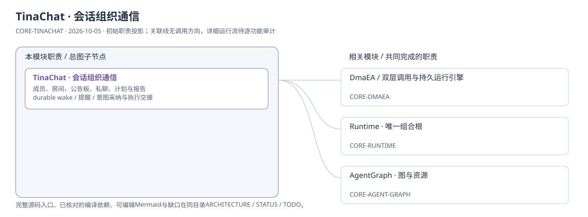
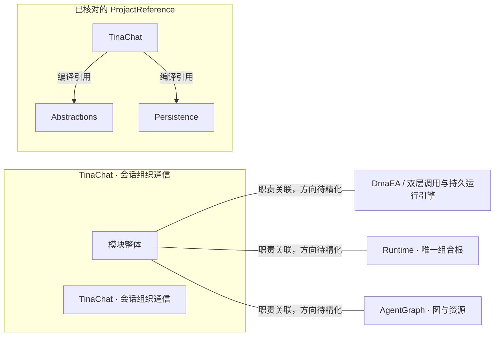

# TinaChat · 会话组织通信：模块架构

模块ID：`CORE-TINACHAT` · 基线：2026-10-05，b6115e6 + 当前工作树。

这是总图的**模块职责投影**：实线无箭头表示相关职责，不表示调用先后。逐模块审计任务将补充成功/失败、控制流、数据流和恢复关系；仅ProjectReference箭头表示已从工程文件读出的编译依赖。

## 可编辑架构图

## 模块边界与输入/输出

| 职责 | 当前边界 | 来源 |
| --- | --- | --- |
| TinaChat · 会话组织通信 | 每个会话可形成组织，成员通过它沟通。持久唤醒与运行补丁连接执行者/常驻治理角色；全局聊天室 UI 已移除，Core 只读观察 API 保留。 | [TinadecCore/TinaChat/TinaChatModuleRegistrar.cs](../../../../../TinadecCore/TinaChat/TinaChatModuleRegistrar.cs) |

## 已核对的编译引用

工程文件：[TinadecCore/TinaChat/TinadecCore.TinaChat.csproj](../../../../../TinadecCore/TinaChat/TinadecCore.TinaChat.csproj)。

- Abstractions
- Persistence

## 继续精化时必须补齐

- 实际入口、调用方向与状态所有者；每个有向关系有源码依据。
- 成功与错误/取消路径、身份/权限边界、异步与恢复时序。
- 哪些是Core内部端口、哪些跨进程/HTTP/stdio，哪些仅是UI职责关联。
- 已确认缺口使用不同标记；目标图与当前图分别说明，避免合并成假现状。

任务入口：[CORE-TINACHAT-001](TODO.md#core-tinachat-001)。
