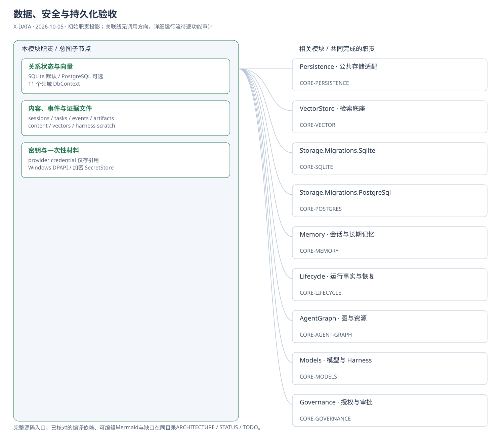
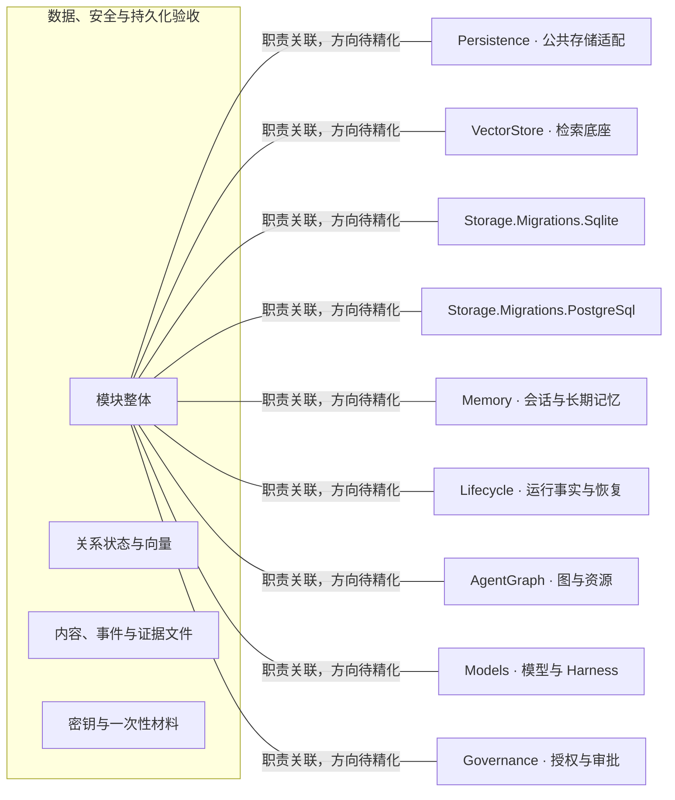

# 数据、安全与持久化验收：模块架构

模块ID：`X-DATA` · 基线：2026-10-05，b6115e6 + 当前工作树。

这是总图的**模块职责投影**：实线无箭头表示相关职责，不表示调用先后。逐模块审计任务将补充成功/失败、控制流、数据流和恢复关系；仅ProjectReference箭头表示已从工程文件读出的编译依赖。

## 可编辑架构图

## 模块边界与输入/输出

| 职责 | 当前边界 | 来源 |
| --- | --- | --- |
| 关系状态与向量 | DbContext：Tenancy、AgentConfiguration、Lifecycle、Governance、Models、Prompts、Memory、Integration、AgentControl、AgentGraph、TinaChat。各自分区，不代表 11 台数据库。 | [TinadecCore/Persistence/TinadecDatabaseConfigurer.cs](../../../../../TinadecCore/Persistence/TinadecDatabaseConfigurer.cs) |
| 内容、事件与证据文件 | Core-owned data root管理sessions/tasks/events/artifacts/content/vectors/harness-workspaces。正文经内容引用连接关系记录，证据与快照各有生命周期。 | [TinadecCore/Persistence/StoragePaths.cs:24](../../../../../TinadecCore/Persistence/StoragePaths.cs#L24) |
| 密钥与一次性材料 | 密钥不作为普通业务字段或事件正文导出；动作审批还关联一次性nonce与参数/manifest身份绑定。Windows默认DPAPI，POSIX默认AES-GCM加密文件。 | [TinadecCore/Persistence/SecretStoreFactory.cs](../../../../../TinadecCore/Persistence/SecretStoreFactory.cs) |

## 继续精化时必须补齐

- 实际入口、调用方向与状态所有者；每个有向关系有源码依据。
- 成功与错误/取消路径、身份/权限边界、异步与恢复时序。
- 哪些是Core内部端口、哪些跨进程/HTTP/stdio，哪些仅是UI职责关联。
- 已确认缺口使用不同标记；目标图与当前图分别说明，避免合并成假现状。

任务入口：[X-DATA-001](TODO.md#x-data-001)。
