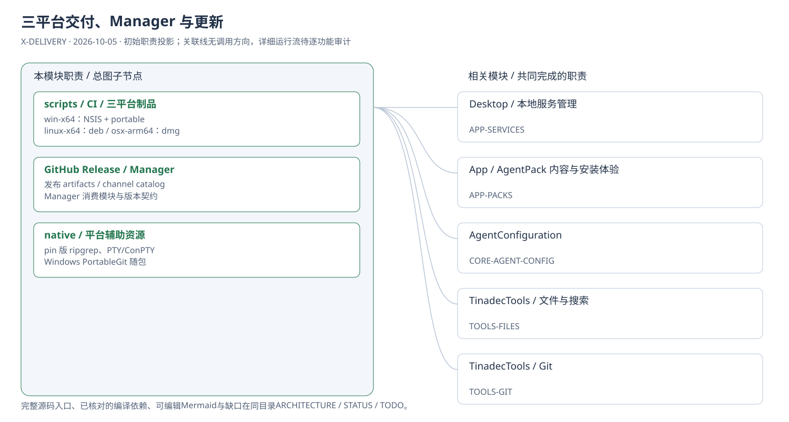
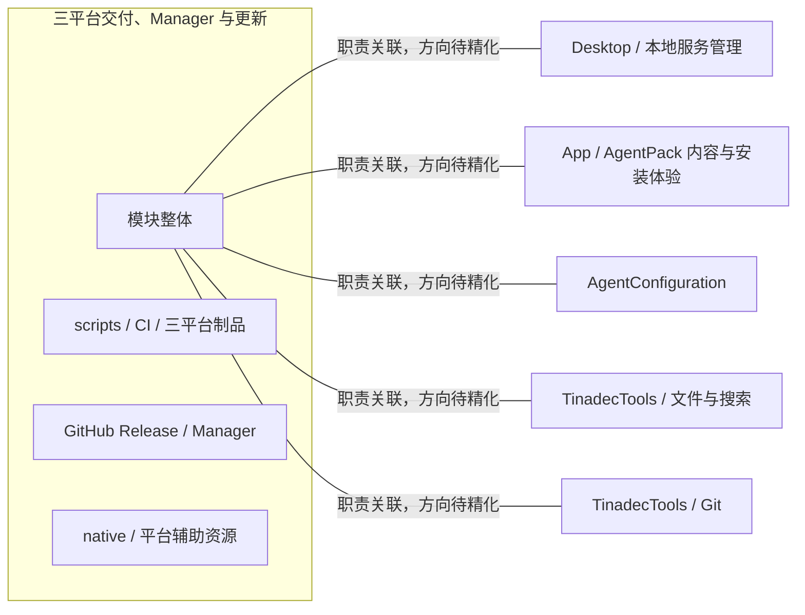

# 三平台交付、Manager 与更新：模块架构

模块ID：`X-DELIVERY` · 基线：2026-10-05，b6115e6 + 当前工作树。

这是总图的**模块职责投影**：实线无箭头表示相关职责，不表示调用先后。逐模块审计任务将补充成功/失败、控制流、数据流和恢复关系；仅ProjectReference箭头表示已从工程文件读出的编译依赖。

## 可编辑架构图

## 模块边界与输入/输出

| 职责 | 当前边界 | 来源 |
| --- | --- | --- |
| scripts / CI / 三平台制品 | 原生平台 runner 执行 staging/打包/校验。完整 Office 安装器与独立运行时模块/AgentPack 同时发布，版本和 digest 分别记录。 | [.github/workflows/desktop-release.yml:69](../../../../../.github/workflows/desktop-release.yml#L69) |
| GitHub Release / Manager | Manager是仓库外消费者。发布产物/模块元数据与catalog已有实现，但当前serviceManager只读内置runtime，未接机器注册；规范中的Office注册交接属于目标。Core NuGet可打包与已发布另行区分。 | [docs/tinadec-office-release-contract.zh-CN.md](../../../../tinadec-office-release-contract.zh-CN.md) |
| native / 平台辅助资源 | 三平台附带原生搜索及 PTY 相关资源；Windows 另携带 PortableGit，POSIX 使用系统 Git。native/codex-src 当前不是产品运行依赖。 | [apps/desktop/scripts/runtimeTargets.mjs:8](../../../../../apps/desktop/scripts/runtimeTargets.mjs#L8) |

## 继续精化时必须补齐

- 实际入口、调用方向与状态所有者；每个有向关系有源码依据。
- 成功与错误/取消路径、身份/权限边界、异步与恢复时序。
- 哪些是Core内部端口、哪些跨进程/HTTP/stdio，哪些仅是UI职责关联。
- 已确认缺口使用不同标记；目标图与当前图分别说明，避免合并成假现状。

任务入口：[X-DELIVERY-001](TODO.md#x-delivery-001)。
