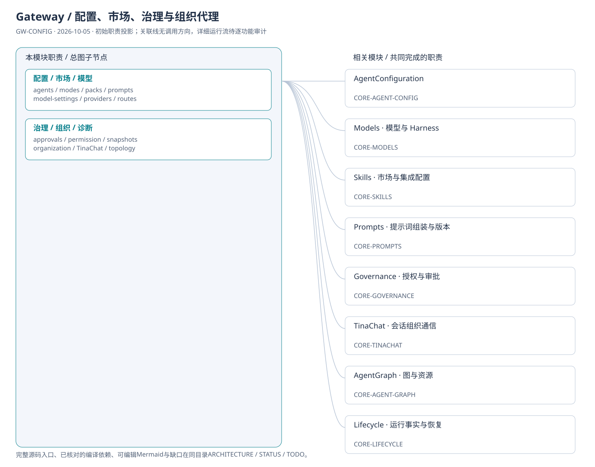
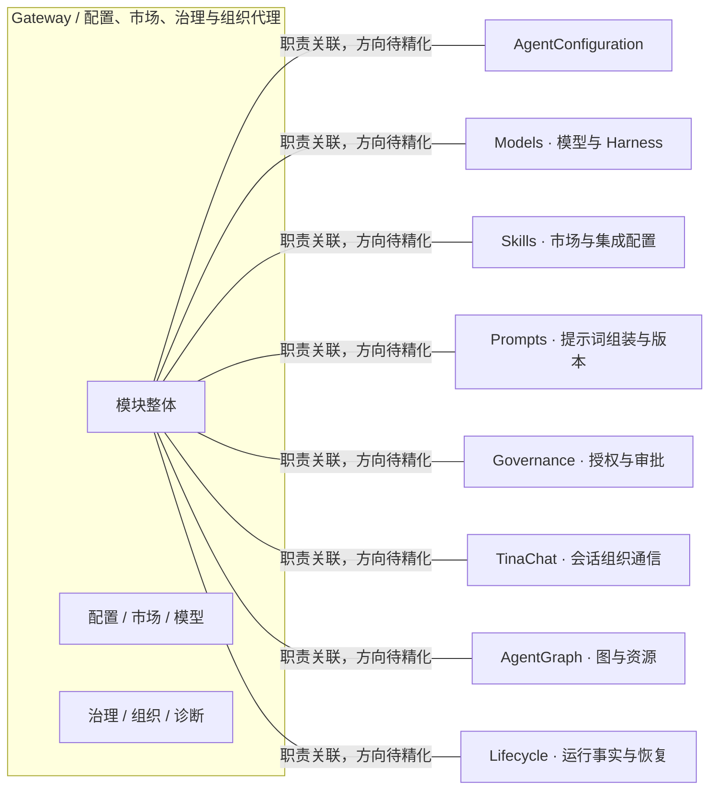

# Gateway / 配置、市场、治理与组织代理：模块架构

模块ID：`GW-CONFIG` · 基线：2026-10-05，b6115e6 + 当前工作树。

这是总图的**模块职责投影**：实线无箭头表示相关职责，不表示调用先后。逐模块审计任务将补充成功/失败、控制流、数据流和恢复关系；仅ProjectReference箭头表示已从工程文件读出的编译依赖。

## 可编辑架构图

## 模块边界与输入/输出

| 职责 | 当前边界 | 来源 |
| --- | --- | --- |
| 配置 / 市场 / 模型 | 前端配置与市场路由族，包括harness与model-routes；不存在/api/v1/skills字面路由。发布/安装/模型绑定业务规则由Core完成。 | [TinadecGateway/src/index.ts](../../../../../TinadecGateway/src/index.ts) |
| 治理 / 组织 / 诊断 | 组织与 TinaChat 契约分别有同步生成的接口/路由表；审批、拓扑与调试仍是 Core 权威。 | [TinadecGateway/src/organizationRoutes.ts](../../../../../TinadecGateway/src/organizationRoutes.ts) |

## 继续精化时必须补齐

- 实际入口、调用方向与状态所有者；每个有向关系有源码依据。
- 成功与错误/取消路径、身份/权限边界、异步与恢复时序。
- 哪些是Core内部端口、哪些跨进程/HTTP/stdio，哪些仅是UI职责关联。
- 已确认缺口使用不同标记；目标图与当前图分别说明，避免合并成假现状。

任务入口：[GW-CONFIG-001](TODO.md#gw-config-001)。
