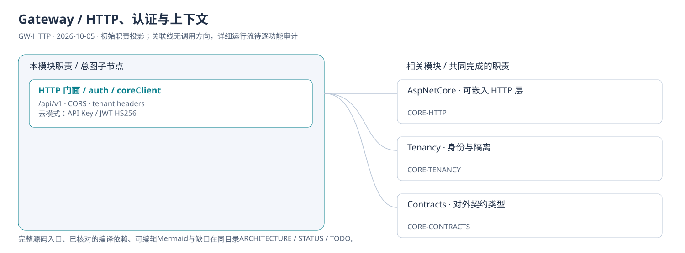
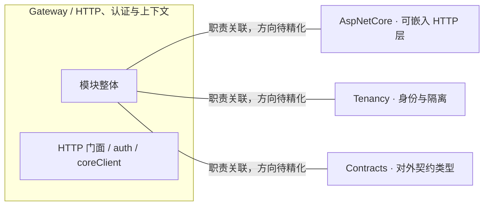
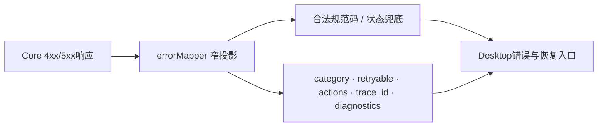

# Gateway / HTTP、认证与上下文：模块架构

模块ID：`GW-HTTP` · 基线：2026-10-05，b6115e6 + 当前工作树。

这是总图的**模块职责投影**：实线无箭头表示相关职责，不表示调用先后。逐模块审计任务将补充成功/失败、控制流、数据流和恢复关系；仅ProjectReference箭头表示已从工程文件读出的编译依赖。

## 可编辑架构图

## 模块边界与输入/输出

| 职责 | 当前边界 | 来源 |
| --- | --- | --- |
| HTTP 门面 / auth / coreClient | 云端认证支持API Key/JWT HS256与tenant headers，本地模式跳过认证。coreClient构造上游请求、转发错误，映射器投影前端契约；新增Core字段需同步投影与快照。 | [TinadecGateway/src/auth.ts](../../../../../TinadecGateway/src/auth.ts) |

## 2026-10-10 公开错误合同

APP-HOME-107统一持有本次接口回归；见[总报告](../../../../../.tinadec_dev/reports/2026-10-10-interface-regression.zh-CN.md)。Gateway仍是无状态代理，Core错误不再依赖逐码白名单。

- 合法lower snake_case公开码原样保留；既有uppercase常量按原映射处理，未知规范uppercase降为lowercase。无效/缺少code按5xx=`internal_error`、其余=`invalid_request`兜底。
- `category`与`actions`限公开枚举，`retryable`限boolean、trace_id限string；诊断只传code/message/severity与正整数line/column。任意上游扩展不展开到外部错误。
- Project不可用行使用同一公开恢复投影；catch-all保持错误HTTP状态并使用internal_error，不把服务故障假装用户输入错误。
- Storage Id和host header仍不透明转发；Gateway不解释任意路径授权、不签发renderer宿主凭据。规范错误码不能提升宿主权限。

代理合同与快照/schema已验证（定向32/32、全量103/103），20个既有测试mock的Bun fetch.preconnect类型断言问题单列，不代表产品源码错误。完整本地/云端认证、平台和安装器仍保留各自验收边界。

## 继续精化时必须补齐

- 实际入口、调用方向与状态所有者；每个有向关系有源码依据。
- 成功与错误/取消路径、身份/权限边界、异步与恢复时序。
- 哪些是Core内部端口、哪些跨进程/HTTP/stdio，哪些仅是UI职责关联。
- 已确认缺口使用不同标记；目标图与当前图分别说明，避免合并成假现状。

任务入口：[GW-HTTP-001](TODO.md#gw-http-001)。
