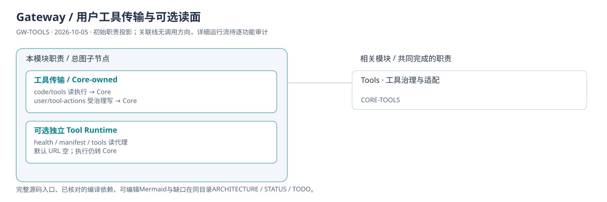
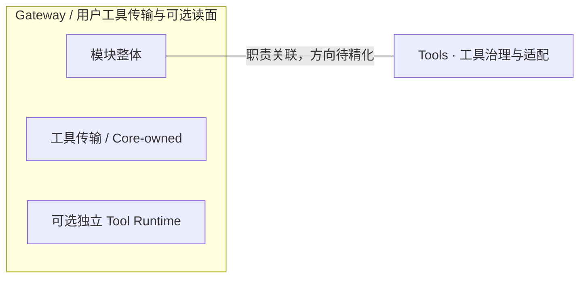

# Gateway / 用户工具传输与可选读面：模块架构

模块ID：`GW-TOOLS` · 基线：2026-10-05，b6115e6 + 当前工作树。

这是总图的**模块职责投影**：实线无箭头表示相关职责，不表示调用先后。逐模块审计任务将补充成功/失败、控制流、数据流和恢复关系；仅ProjectReference箭头表示已从工程文件读出的编译依赖。

## 可编辑架构图

## 模块边界与输入/输出

| 职责 | 当前边界 | 来源 |
| --- | --- | --- |
| 工具传输 / Core-owned | 当前 code/tools execute 代理 Core 的 tools execute。用户写动作走 Core UserToolActionService；智能体写走冻结 run 的 dispatcher。 | [TinadecGateway/src/index.ts:1200](../../../../../TinadecGateway/src/index.ts#L1200) |
| 可选独立 Tool Runtime | 仅显式配置时这三个只读接口转独立服务。未配置时health/tools回Core，manifest返回501。执行接口始终经Core；本机Tools由Core stdio子进程承载。 | [TinadecGateway/src/config.ts:74](../../../../../TinadecGateway/src/config.ts#L74) |

## 继续精化时必须补齐

- 实际入口、调用方向与状态所有者；每个有向关系有源码依据。
- 成功与错误/取消路径、身份/权限边界、异步与恢复时序。
- 哪些是Core内部端口、哪些跨进程/HTTP/stdio，哪些仅是UI职责关联。
- 已确认缺口使用不同标记；目标图与当前图分别说明，避免合并成假现状。

任务入口：[GW-TOOLS-001](TODO.md#gw-tools-001)。
