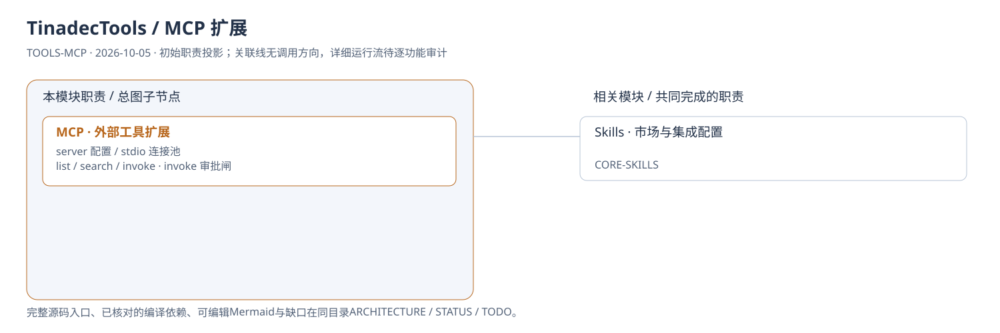
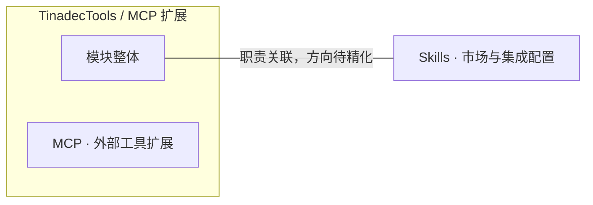
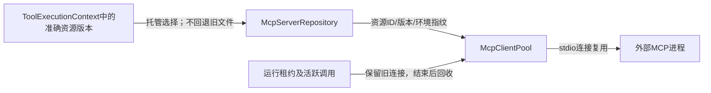

# TinadecTools / MCP 扩展：模块架构

模块ID：`TOOLS-MCP` · 基线：2026-10-05，b6115e6 + 当前工作树。

这是总图的**模块职责投影**：实线无箭头表示相关职责，不表示调用先后。逐模块审计任务将补充成功/失败、控制流、数据流和恢复关系；仅ProjectReference箭头表示已从工程文件读出的编译依赖。

## 可编辑架构图

## 模块边界与输入/输出

| 职责 | 当前边界 | 来源 |
| --- | --- | --- |
| MCP · 外部工具扩展 | 当前实现是 stdio MCP client。浏览器等工具可由配置的外部 MCP server 提供；此处不假设自带浏览器自动化或 A2A 运行模块。 | [TinadecTools/Tools/Mcp/McpClientPool.cs:63](../../../../../TinadecTools/Tools/Mcp/McpClientPool.cs#L63) |

## 继续精化时必须补齐

- 实际入口、调用方向与状态所有者；每个有向关系有源码依据。
- 成功与错误/取消路径、身份/权限边界、异步与恢复时序。
- 哪些是Core内部端口、哪些跨进程/HTTP/stdio，哪些仅是UI职责关联。
- 已确认缺口使用不同标记；目标图与当前图分别说明，避免合并成假现状。

任务入口：[TOOLS-MCP-001](TODO.md#tools-mcp-001)。

## 2026-10-08 托管版本连接

箭头依据：[资源选择](../../../../../TinadecTools/Tools/Mcp/McpServerRepository.cs)、[连接池](../../../../../TinadecTools/Tools/Mcp/McpClientPool.cs)、[可信上下文](../../../../../TinadecTools/Runtime/ToolExecutionContext.cs)。新版本开新连接，旧运行继续用其版本。Core的导入和市场安装写同一资源库；Tools独立模式仍允许文件配置，不能成为托管运行的第二配置来源。
