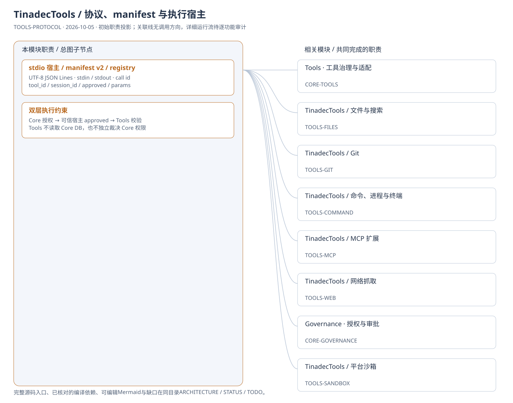
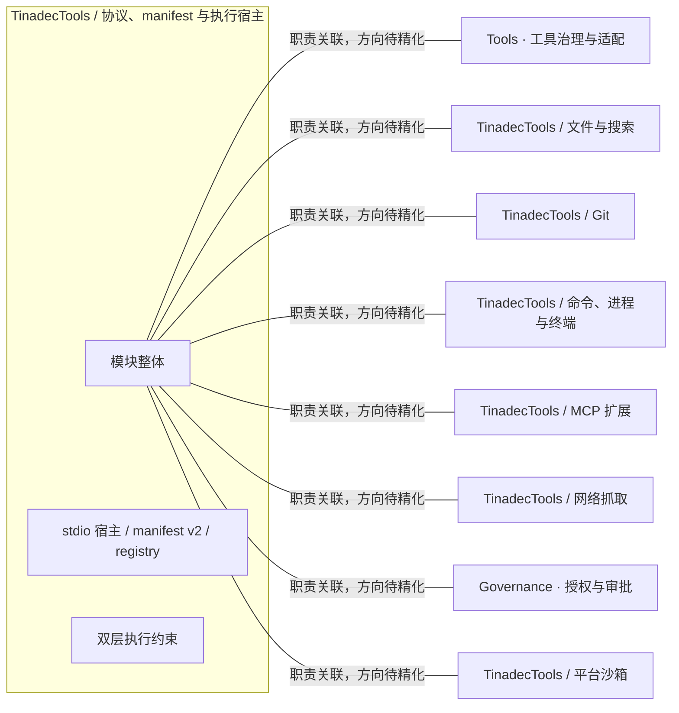
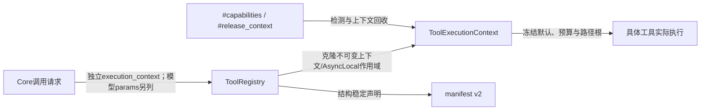

# TinadecTools / 协议、manifest 与执行宿主：模块架构

模块ID：`TOOLS-PROTOCOL` · 基线：2026-10-05，b6115e6 + 当前工作树。

这是总图的**模块职责投影**：实线无箭头表示相关职责，不表示调用先后。逐模块审计任务将补充成功/失败、控制流、数据流和恢复关系；仅ProjectReference箭头表示已从工程文件读出的编译依赖。

## 可编辑架构图

## 模块边界与输入/输出

| 职责 | 当前边界 | 来源 |
| --- | --- | --- |
| stdio 宿主 / manifest v2 / registry | Core 按 workspace/execution root 管理 Tools 子进程。先取 #manifest 并冻结目录/hash；请求与结果按调用 id 关联，终端事件也走该管道。 | [TinadecTools/Abstractions/ToolCalling.cs:11](../../../../../TinadecTools/Abstractions/ToolCalling.cs#L11) |
| 双层执行约束 | 工具的 approved 字段来自可信宿主；工具在此基础上检查路径、确认、分支及沙箱约束。两层职责不可混淆。 | [TinadecTools/Abstractions/ToolRegistry.cs:117](../../../../../TinadecTools/Abstractions/ToolRegistry.cs#L117) |

## 继续精化时必须补齐

- 实际入口、调用方向与状态所有者；每个有向关系有源码依据。
- 成功与错误/取消路径、身份/权限边界、异步与恢复时序。
- 哪些是Core内部端口、哪些跨进程/HTTP/stdio，哪些仅是UI职责关联。
- 已确认缺口使用不同标记；目标图与当前图分别说明，避免合并成假现状。

任务入口：[TOOLS-PROTOCOL-001](TODO.md#tools-protocol-001)。

## 2026-10-08 每次调用的可信上下文

箭头依据：[Registry](../../../../../TinadecTools/Abstractions/ToolRegistry.cs)、[协议DTO](../../../../../TinadecTools/Abstractions/ToolCalling.cs)、[上下文](../../../../../TinadecTools/Runtime/ToolExecutionContext.cs)、[宿主控制](../../../../../TinadecTools/Runtime/ToolHostControls.cs)。模型目录和实际执行均应用配置限制；独立Tools没有托管上下文时维持原文件模式。平台沙箱、哈希、链接与授权边界仍由执行实现约束。
