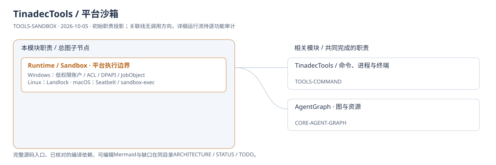
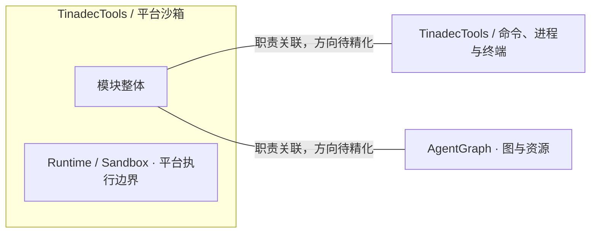
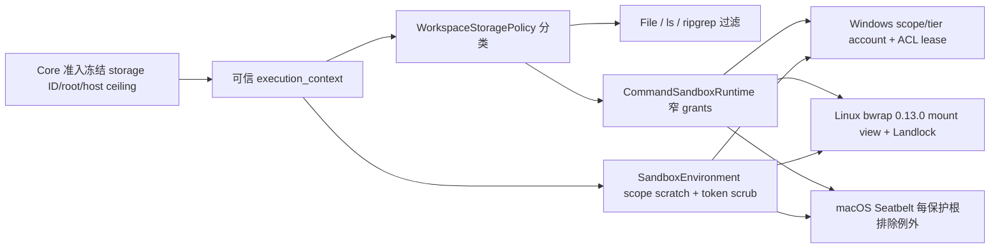

# TinadecTools / 平台沙箱：模块架构

模块ID：`TOOLS-SANDBOX` · 基线：2026-10-05，b6115e6 + 当前工作树。

这是总图的**模块职责投影**：实线无箭头表示相关职责，不表示调用先后。逐模块审计任务将补充成功/失败、控制流、数据流和恢复关系；仅ProjectReference箭头表示已从工程文件读出的编译依赖。

## 可编辑架构图

## 2026-10-09 存储执行数据流

`WorkingDirectory` 由 host 已验证 assignment 填入；仅该 worktree checkout 是源码例外，不能开放同scope其它检出。config/skills 默认可写，内部运行分类默认拒绝；user security/state 和其它scope永久保护。源码依据为 `ToolConfigurationResolver`、`ToolDispatcher`、`WorkspaceStoragePolicy`、`CommandSandboxRuntime` 及三个后端。平台缺失拒绝启动；MCP SDK server 属单独的可信程序执行边界。

`SandboxPolicyStore`仅管理独立Tools已审批运行历史，写入`state/sandbox-grants.toml`，不是Agent可编辑的config。严格固定schema和预算、拒链接及过宽/永久host域写授权，原子替换；Core冻结execution_context绕开此文件，persist/reset不能影响后续或当前受治理授权。TOML读写使用Tomlyn显式source-generated typeinfo，不启用反射兜底。

Linux 的 bwrap 保留 `--die-with-parent`。启动 bwrap 的专用后台线程持续 `WaitForExit`，避免 `PR_SET_PDEATHSIG` 随短命请求线程结束而提前杀死命令。`/dev/null` 只用精确设备 `--dev-bind`，普通 `--bind` 的 nodev 限制会拒绝该设备读写；不增加 `/dev` 父目录授权。PID 命名空间中的 `$!` 不能用于宿主 `kill(pid, 0)`；终止回归在超时前通过 NSpid、父 shell 唯一脚本和启动时间确定实际宿主子进程，随后核对该身份消失或已退出的 zombie 状态。

## 模块边界与输入/输出

| 职责 | 当前边界 | 来源 |
| --- | --- | --- |
| Runtime / Sandbox · 平台执行边界 | 自动选择平台后端，处理环境清洗、超时与流式命令；取消传播逐平台待验收。Windows 初次低权限账户设置可能需 UAC。不能把不同平台的实现画成同等完整隔离。 | [TinadecTools/Runtime/Sandbox/CommandSandboxRuntime.cs:19](../../../../../TinadecTools/Runtime/Sandbox/CommandSandboxRuntime.cs#L19) |

## 继续精化时必须补齐

- 实际入口、调用方向与状态所有者；每个有向关系有源码依据。
- 成功与错误/取消路径、身份/权限边界、异步与恢复时序。
- 哪些是Core内部端口、哪些跨进程/HTTP/stdio，哪些仅是UI职责关联。
- 已确认缺口使用不同标记；目标图与当前图分别说明，避免合并成假现状。

任务入口：[TOOLS-SANDBOX-001](TODO.md#tools-sandbox-001)。
